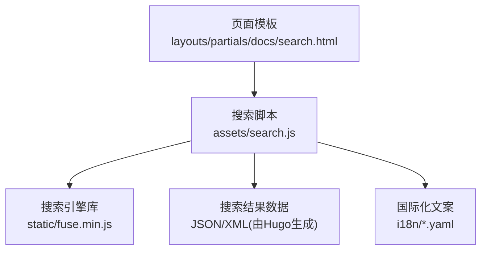
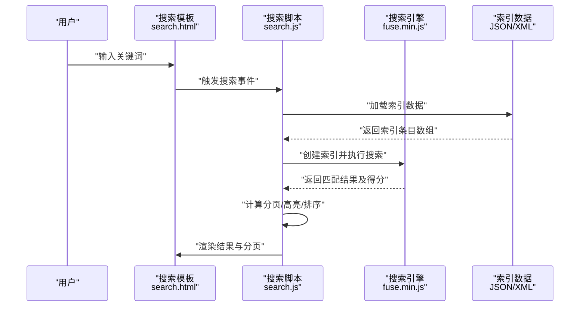
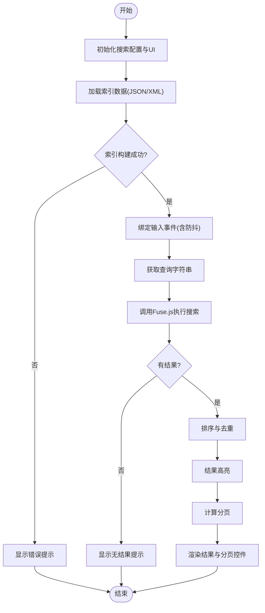
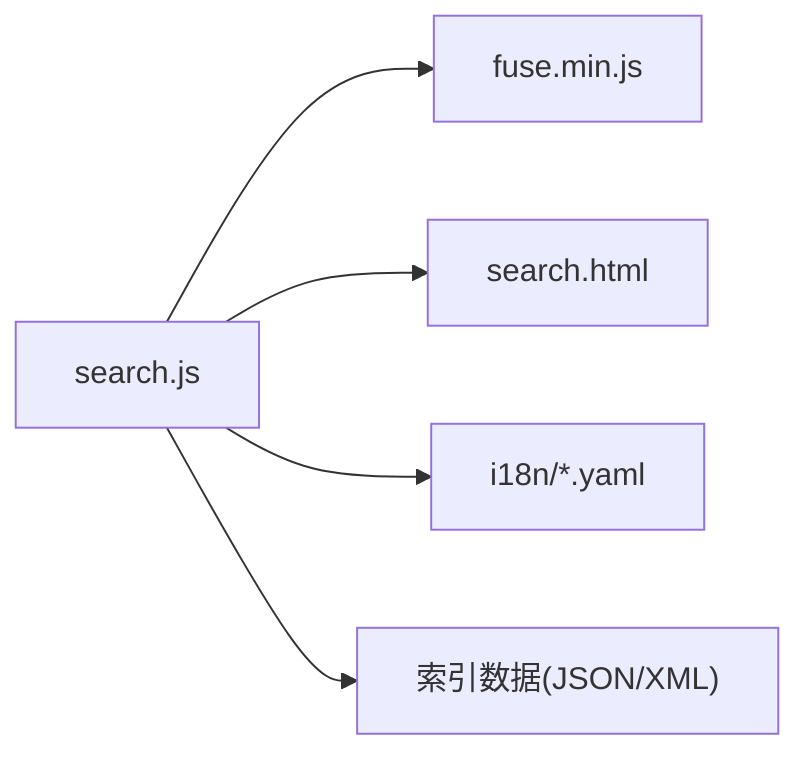

# 全文搜索功能

<cite>
**本文引用的文件**   
- [hugo-book/search.js](file://themes/hugo-book/assets/search.js)
- [hugo-book/fuse.min.js](file://themes/hugo-book/static/fuse.min.js)
- [hugo-book/layouts/partials/docs/search.html](file://themes/hugo-book/layouts/partials/docs/search.html)
- [hugo-book/i18n/zh.yaml](file://themes/hugo-book/i18n/zh.yaml)
- [hugo-book/i18n/en.yaml](file://themes/hugo-book/i18n/en.yaml)
- [config.yaml](file://config.yaml)
- [hugo.toml](file://hugo.toml)
</cite>

## 目录
1. [简介](#简介)
2. [项目结构](#项目结构)
3. [核心组件](#核心组件)
4. [架构总览](#架构总览)
5. [详细组件分析](#详细组件分析)
6. [依赖关系分析](#依赖关系分析)
7. [性能考量](#性能考量)
8. [故障排查指南](#故障排查指南)
9. [结论](#结论)
10. [附录](#附录)

## 简介
本技术文档聚焦于基于 Fuse.js 的客户端全文搜索实现，覆盖索引构建、搜索算法配置与优化策略；深入解析 search.js 的实现逻辑（搜索框交互、结果高亮、分页等）；说明 Hugo 配置中与搜索相关的选项（索引字段、权重、语言支持等）；并提供排序、模糊匹配、拼音搜索等体验优化最佳实践与调试技巧。

## 项目结构
本项目采用 Hugo + hugo-book 主题的结构，搜索能力由主题提供：
- 前端脚本与库
  - assets/search.js：主题内搜索交互与渲染逻辑
  - static/fuse.min.js：Fuse.js 客户端搜索引擎库
- 模板与国际化
  - layouts/partials/docs/search.html：搜索 UI 片段（输入框、结果容器等）
  - i18n/*.yaml：多语言文案（占位符、提示语等）
- 站点配置
  - config.yaml / hugo.toml：Hugo 站点级配置（可包含搜索相关设置）

图表来源
- [hugo-book/layouts/partials/docs/search.html](file://themes/hugo-book/layouts/partials/docs/search.html)
- [hugo-book/assets/search.js](file://themes/hugo-book/assets/search.js)
- [hugo-book/static/fuse.min.js](file://themes/hugo-book/static/fuse.min.js)
- [hugo-book/i18n/zh.yaml](file://themes/hugo-book/i18n/zh.yaml)
- [hugo-book/i18n/en.yaml](file://themes/hugo-book/i18n/en.yaml)

章节来源
- [hugo-book/assets/search.js](file://themes/hugo-book/assets/search.js)
- [hugo-book/static/fuse.min.js](file://themes/hugo-book/static/fuse.min.js)
- [hugo-book/layouts/partials/docs/search.html](file://themes/hugo-book/layouts/partials/docs/search.html)
- [hugo-book/i18n/zh.yaml](file://themes/hugo-book/i18n/zh.yaml)
- [hugo-book/i18n/en.yaml](file://themes/hugo-book/i18n/en.yaml)
- [config.yaml](file://config.yaml)
- [hugo.toml](file://hugo.toml)

## 核心组件
- Fuse.js 引擎
  - 负责在浏览器端对预构建的索引进行快速检索，支持模糊匹配、评分、正则、分词等。
- 搜索脚本 search.js
  - 负责 DOM 事件绑定、请求索引数据、调用 Fuse.js 执行搜索、渲染结果、处理分页与高亮。
- 搜索模板 partials/docs/search.html
  - 提供搜索输入框、结果列表容器、分页控件等 HTML 骨架。
- 国际化资源 i18n/*.yaml
  - 提供搜索界面文案（如“请输入关键词”、“无结果”等）。
- 站点配置 config.yaml / hugo.toml
  - 控制是否启用搜索、索引字段、权重、语言等（具体键名以主题实现为准）。

章节来源
- [hugo-book/assets/search.js](file://themes/hugo-book/assets/search.js)
- [hugo-book/layouts/partials/docs/search.html](file://themes/hugo-book/layouts/partials/docs/search.html)
- [hugo-book/i18n/zh.yaml](file://themes/hugo-book/i18n/zh.yaml)
- [hugo-book/i18n/en.yaml](file://themes/hugo-book/i18n/en.yaml)
- [config.yaml](file://config.yaml)
- [hugo.toml](file://hugo.toml)

## 架构总览
下图展示了从用户输入到结果渲染的端到端流程，以及各模块之间的依赖关系。

图表来源
- [hugo-book/layouts/partials/docs/search.html](file://themes/hugo-book/layouts/partials/docs/search.html)
- [hugo-book/assets/search.js](file://themes/hugo-book/assets/search.js)
- [hugo-book/static/fuse.min.js](file://themes/hugo-book/static/fuse.min.js)

## 详细组件分析

### 搜索脚本 search.js 实现逻辑
- 初始化与依赖
  - 引入 Fuse.js 库，准备搜索配置对象（字段、权重、阈值、忽略大小写、是否使用正则等）。
  - 读取国际化文案，用于占位符与提示信息。
- 索引构建
  - 拉取站点生成的索引数据（通常为 JSON 或 XML），将其转换为 Fuse.js 所需的条目格式。
  - 根据配置选择索引字段（如标题、摘要、正文等），并为不同字段设置权重。
- 搜索执行
  - 监听输入框事件（防抖），将查询字符串传入 Fuse.js 进行搜索。
  - 根据得分排序，必要时应用自定义排序规则（如按时间、分类权重等）。
- 结果渲染
  - 对命中片段进行高亮显示（包裹标签或样式类）。
  - 渲染结果列表，展示标题、链接、摘要等。
- 分页处理
  - 根据每页条数与总结果数计算分页信息，渲染上一页/下一页按钮与页码。
  - 切换页码时重新渲染对应页的结果。
- 错误与边界
  - 空查询、网络异常、索引为空时的友好提示。
  - 大结果集的分片渲染与内存占用控制。

图表来源
- [hugo-book/assets/search.js](file://themes/hugo-book/assets/search.js)

章节来源
- [hugo-book/assets/search.js](file://themes/hugo-book/assets/search.js)

### 搜索模板 search.html
- 提供搜索输入框、结果容器、分页控件的 HTML 结构。
- 通过 data-* 属性或 ID 与 search.js 交互。
- 集成国际化占位符与提示文案。

章节来源
- [hugo-book/layouts/partials/docs/search.html](file://themes/hugo-book/layouts/partials/docs/search.html)

### 搜索引擎库 fuse.min.js
- 提供客户端全文检索能力，包括：
  - 模糊匹配（编辑距离）、正则表达式、前缀匹配
  - 字段权重与阈值控制
  - 结果评分与排序
- 在本项目中作为静态资源被 search.js 引用。

章节来源
- [hugo-book/static/fuse.min.js](file://themes/hugo-book/static/fuse.min.js)

### 国际化资源 zh.yaml / en.yaml
- 提供搜索界面的中文与英文文案（如占位符、无结果提示、分页文案等）。
- search.js 在渲染时读取相应语言包，确保界面本地化。

章节来源
- [hugo-book/i18n/zh.yaml](file://themes/hugo-book/i18n/zh.yaml)
- [hugo-book/i18n/en.yaml](file://themes/hugo-book/i18n/en.yaml)

### Hugo 配置中的搜索相关选项
- 常见配置项（具体键名以主题实现为准）：
  - 是否启用搜索开关
  - 索引字段列表（标题、摘要、正文、标签等）
  - 字段权重（影响排序）
  - 语言支持（是否启用中文分词或多语言索引）
  - 分页大小（每页结果数量）
- 配置文件位置：
  - config.yaml
  - hugo.toml

章节来源
- [config.yaml](file://config.yaml)
- [hugo.toml](file://hugo.toml)

## 依赖关系分析
- 组件耦合
  - search.js 强依赖 fuse.min.js 与 search.html 的 DOM 结构。
  - search.js 依赖 i18n 文案进行界面文本渲染。
  - 索引数据由 Hugo 构建阶段生成，search.js 在运行时加载。
- 外部依赖
  - Fuse.js 为唯一外部 JS 依赖，其余均为主题内部资源。

图表来源
- [hugo-book/assets/search.js](file://themes/hugo-book/assets/search.js)
- [hugo-book/static/fuse.min.js](file://themes/hugo-book/static/fuse.min.js)
- [hugo-book/layouts/partials/docs/search.html](file://themes/hugo-book/layouts/partials/docs/search.html)
- [hugo-book/i18n/zh.yaml](file://themes/hugo-book/i18n/zh.yaml)
- [hugo-book/i18n/en.yaml](file://themes/hugo-book/i18n/en.yaml)

章节来源
- [hugo-book/assets/search.js](file://themes/hugo-book/assets/search.js)
- [hugo-book/static/fuse.min.js](file://themes/hugo-book/static/fuse.min.js)
- [hugo-book/layouts/partials/docs/search.html](file://themes/hugo-book/layouts/partials/docs/search.html)
- [hugo-book/i18n/zh.yaml](file://themes/hugo-book/i18n/zh.yaml)
- [hugo-book/i18n/en.yaml](file://themes/hugo-book/i18n/en.yaml)

## 性能考量
- 索引体积与加载时间
  - 合理选择索引字段与权重，避免将过长正文全部纳入索引。
  - 使用压缩与缓存策略（浏览器缓存、CDN）。
- 搜索延迟与用户体验
  - 输入防抖，减少频繁搜索。
  - 分页与大结果集的分片渲染，降低主线程阻塞。
- 模糊匹配与正则
  - 谨慎开启正则与高模糊度，可能显著增加计算开销。
- 内存占用
  - 控制索引条目数量与字段长度，及时释放无用引用。

[本节为通用指导，不直接分析具体文件]

## 故障排查指南
- 常见问题
  - 搜索无结果：检查索引数据是否正确加载、字段映射是否一致、查询字符串是否为空。
  - 高亮异常：确认高亮标记未被后续渲染覆盖，检查 CSS 样式冲突。
  - 分页失效：验证分页参数与总结果数计算是否正确。
  - 性能问题：关闭不必要的模糊匹配或正则，调整阈值与权重。
- 调试技巧
  - 在浏览器控制台输出索引条目与搜索结果，核对字段与得分。
  - 逐步注释 search.js 中关键步骤，定位问题所在。
  - 使用网络面板检查索引数据的 MIME 类型与缓存状态。

章节来源
- [hugo-book/assets/search.js](file://themes/hugo-book/assets/search.js)

## 结论
本项目的全文搜索基于 Fuse.js 的客户端实现，具备轻量、快速、易扩展的特点。通过合理的索引构建、搜索配置与渲染策略，可在保证性能的同时提供良好的搜索体验。建议在生产环境中结合站点规模持续优化索引字段、权重与分页策略，并根据用户反馈迭代高亮与排序规则。

[本节为总结性内容，不直接分析具体文件]

## 附录
- 术语
  - 索引：供搜索引擎快速检索的数据结构，通常由标题、摘要、正文等字段组成。
  - 权重：字段在排序中的重要性系数，值越高越靠前。
  - 阈值：匹配相似度门槛，值越低匹配越宽松。
- 参考
  - Fuse.js 官方文档（用于理解高级配置与 API）
  - Hugo 主题文档（用于了解搜索相关配置键名）

[本节为补充信息，不直接分析具体文件]