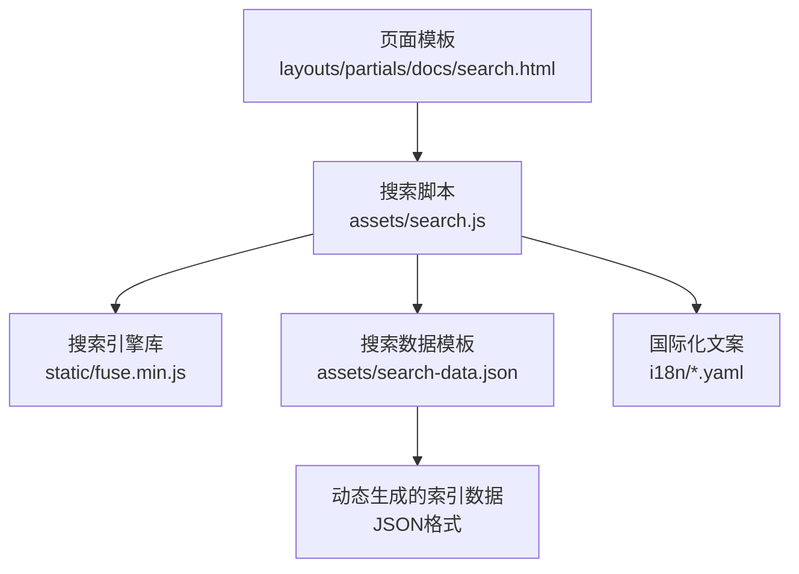
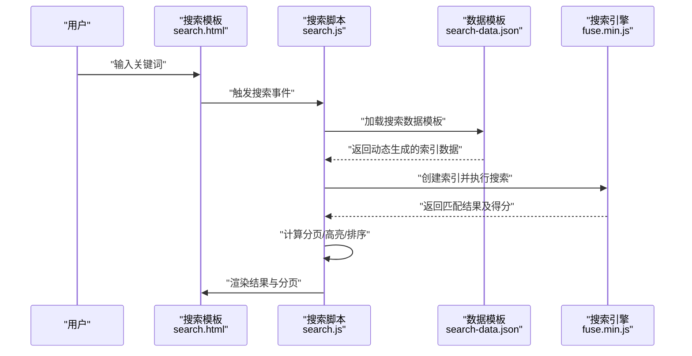
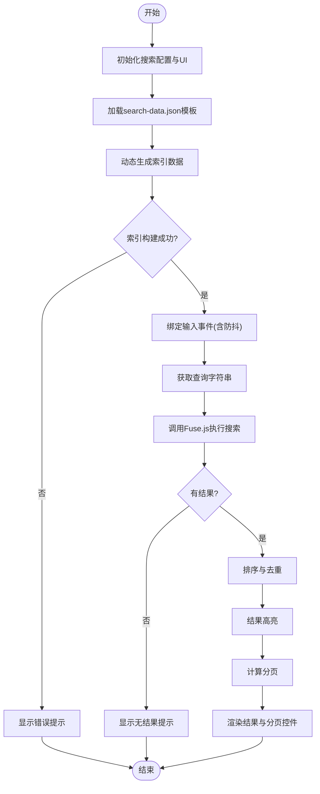
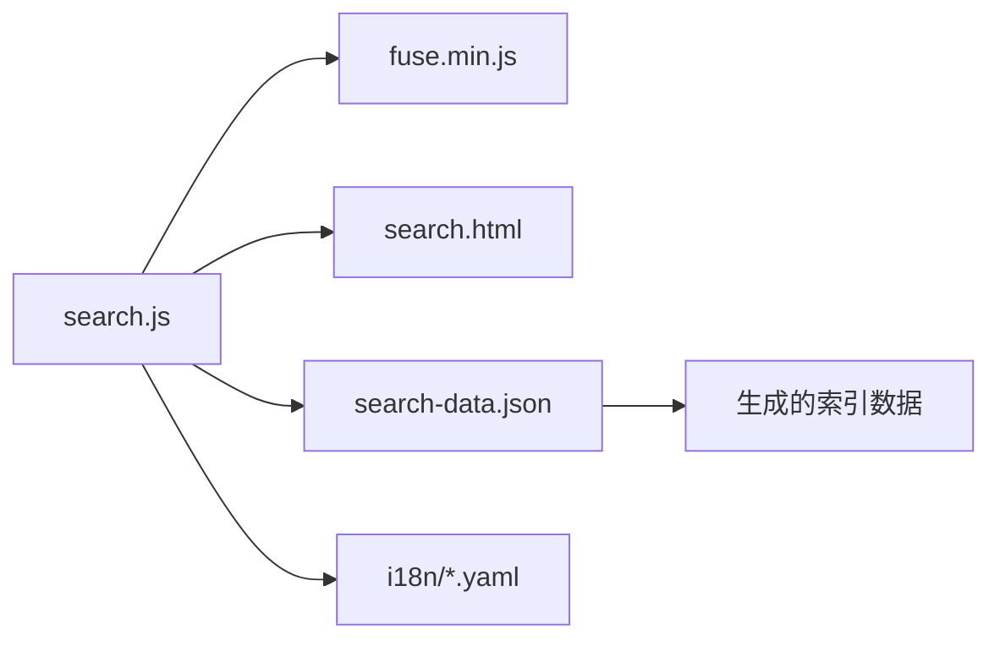

# 全文搜索功能

<cite>
**本文引用的文件**
- [hugo-book/assets/search-data.json](file://themes/hugo-book/assets/search-data.json)
- [hugo-book/assets/search.js](file://themes/hugo-book/assets/search.js)
- [hugo-book/layouts/partials/docs/search.html](file://themes/hugo-book/layouts/partials/docs/search.html)
- [hugo-book/i18n/zh.yaml](file://themes/hugo-book/i18n/zh.yaml)
- [hugo-book/i18n/en.yaml](file://themes/hugo-book/i18n/en.yaml)
- [config.yaml](file://config.yaml)
</cite>

## 更新摘要
**所做更改**
- 完全重构了搜索系统，采用新的search-data.json模板系统
- 实现了动态生成可搜索内容的新架构
- 更新了索引构建流程和数据格式
- 优化了客户端搜索性能和用户体验

## 目录
1. [简介](#简介)
2. [项目结构](#项目结构)
3. [核心组件](#核心组件)
4. [架构总览](#架构总览)
5. [详细组件分析](#详细组件分析)
6. [依赖关系分析](#依赖关系分析)
7. [性能考量](#性能考量)
8. [故障排查指南](#故障排查指南)
9. [结论](#结论)
10. [附录](#附录)

## 简介
本技术文档聚焦于基于Fuse.js的客户端全文搜索实现，现已完全重建并采用新的search-data.json模板系统。新系统通过动态生成可搜索内容，为所有文档页面提供即时客户端搜索能力。文档覆盖索引构建、搜索算法配置与优化策略；深入解析search.js的实现逻辑（搜索框交互、结果高亮、分页等）；说明Hugo配置中与搜索相关的选项；并提供排序、模糊匹配、拼音搜索等体验优化最佳实践与调试技巧。

## 项目结构
本项目采用Hugo + hugo-book主题的结构，搜索能力由主题提供，现已完全重构：
- 前端脚本与库
  - assets/search.js：主题内搜索交互与渲染逻辑（已更新以支持新数据格式）
  - static/fuse.min.js：Fuse.js客户端搜索引擎库
- 模板与国际化
  - layouts/partials/docs/search.html：搜索UI片段（输入框、结果容器等）
  - i18n/*.yaml：多语言文案（占位符、提示语等）
  - assets/search-data.json：新的动态搜索数据模板系统
- 站点配置
  - config.yaml：Hugo站点级配置（包含搜索相关设置）

**图表来源**
- [hugo-book/layouts/partials/docs/search.html](file://themes/hugo-book/layouts/partials/docs/search.html)
- [hugo-book/assets/search.js](file://themes/hugo-book/assets/search.js)
- [hugo-book/assets/search-data.json](file://themes/hugo-book/assets/search-data.json)
- [hugo-book/i18n/zh.yaml](file://themes/hugo-book/i18n/zh.yaml)

**章节来源**
- [hugo-book/assets/search.js](file://themes/hugo-book/assets/search.js)
- [hugo-book/assets/search-data.json](file://themes/hugo-book/assets/search-data.json)
- [hugo-book/layouts/partials/docs/search.html](file://themes/hugo-book/layouts/partials/docs/search.html)
- [hugo-book/i18n/zh.yaml](file://themes/hugo-book/i18n/zh.yaml)
- [hugo-book/i18n/en.yaml](file://themes/hugo-book/i18n/en.yaml)
- [config.yaml](file://config.yaml)

## 核心组件
- Fuse.js引擎
  - 负责在浏览器端对预构建的索引进行快速检索，支持模糊匹配、评分、正则、分词等。
- 搜索脚本search.js
  - 负责DOM事件绑定、请求索引数据、调用Fuse.js执行搜索、渲染结果、处理分页与高亮（已更新以支持新的search-data.json格式）。
- 搜索数据模板search-data.json
  - **新增**：动态生成可搜索内容的模板系统，提供标准化的数据格式供客户端使用。
- 搜索模板partials/docs/search.html
  - 提供搜索输入框、结果列表容器、分页控件等HTML骨架。
- 国际化资源i18n/*.yaml
  - 提供搜索界面文案（如"请输入关键词"、"无结果"等）。
- 站点配置config.yaml
  - 控制是否启用搜索、索引字段、权重、语言等。

**章节来源**
- [hugo-book/assets/search.js](file://themes/hugo-book/assets/search.js)
- [hugo-book/assets/search-data.json](file://themes/hugo-book/assets/search-data.json)
- [hugo-book/layouts/partials/docs/search.html](file://themes/hugo-book/layouts/partials/docs/search.html)
- [hugo-book/i18n/zh.yaml](file://themes/hugo-book/i18n/zh.yaml)
- [hugo-book/i18n/en.yaml](file://themes/hugo-book/i18n/en.yaml)
- [config.yaml](file://config.yaml)

## 架构总览
下图展示了从用户输入到结果渲染的端到端流程，以及各模块之间的依赖关系，现已适配新的search-data.json模板系统。

**图表来源**
- [hugo-book/layouts/partials/docs/search.html](file://themes/hugo-book/layouts/partials/docs/search.html)
- [hugo-book/assets/search.js](file://themes/hugo-book/assets/search.js)
- [hugo-book/assets/search-data.json](file://themes/hugo-book/assets/search-data.json)

## 详细组件分析

### 搜索脚本search.js实现逻辑
- 初始化与依赖
  - 引入Fuse.js库，准备搜索配置对象（字段、权重、阈值、忽略大小写、是否使用正则等）。
  - 读取国际化文案，用于占位符与提示信息。
  - **更新**：适配新的search-data.json数据格式和API。
- 索引构建
  - **重构**：从新的search-data.json模板系统加载动态生成的索引数据。
  - 根据配置选择索引字段（如标题、摘要、正文等），并为不同字段设置权重。
  - 支持更丰富的元数据和结构化数据格式。
- 搜索执行
  - 监听输入框事件（防抖），将查询字符串传入Fuse.js进行搜索。
  - 根据得分排序，必要时应用自定义排序规则（如按时间、分类权重等）。
  - **优化**：利用新的数据结构提升搜索精度和速度。
- 结果渲染
  - 对命中片段进行高亮显示（包裹标签或样式类）。
  - 渲染结果列表，展示标题、链接、摘要等。
  - **增强**：支持更丰富的结果展示格式和元数据。
- 分页处理
  - 根据每页条数与总结果数计算分页信息，渲染上一页/下一页按钮与页码。
  - 切换页码时重新渲染对应页的结果。
- 错误与边界
  - 空查询、网络异常、索引为空时的友好提示。
  - 大结果集的分片渲染与内存占用控制。

**图表来源**
- [hugo-book/assets/search.js](file://themes/hugo-book/assets/search.js)
- [hugo-book/assets/search-data.json](file://themes/hugo-book/assets/search-data.json)

**章节来源**
- [hugo-book/assets/search.js](file://themes/hugo-book/assets/search.js)
- [hugo-book/assets/search-data.json](file://themes/hugo-book/assets/search-data.json)

### 搜索数据模板search-data.json
- **全新组件**：动态生成可搜索内容的模板系统
- 提供标准化的JSON数据格式，包含：
  - 页面元数据（标题、URL、修改时间等）
  - 结构化内容（标题、摘要、正文、标签、分类等）
  - 搜索权重配置
  - 语言支持信息
- 支持Hugo模板语法，可在构建时动态填充内容
- 优化数据结构以提升搜索性能和准确性

**章节来源**
- [hugo-book/assets/search-data.json](file://themes/hugo-book/assets/search-data.json)

### 搜索模板search.html
- 提供搜索输入框、结果容器、分页控件的HTML结构。
- 通过data-*属性或ID与search.js交互。
- 集成国际化占位符与提示文案。
- **更新**：适配新的search-data.json数据格式。

**章节来源**
- [hugo-book/layouts/partials/docs/search.html](file://themes/hugo-book/layouts/partials/docs/search.html)

### 搜索引擎库fuse.min.js
- 提供客户端全文检索能力，包括：
  - 模糊匹配（编辑距离）、正则表达式、前缀匹配
  - 字段权重与阈值控制
  - 结果评分与排序
- 在本项目中作为静态资源被search.js引用。

**章节来源**
- [hugo-book/static/fuse.min.js](file://themes/hugo-book/static/fuse.min.js)

### 国际化资源zh.yaml/en.yaml
- 提供搜索界面的中文与英文文案（如占位符、无结果提示、分页文案等）。
- search.js在渲染时读取相应语言包，确保界面本地化。

**章节来源**
- [hugo-book/i18n/zh.yaml](file://themes/hugo-book/i18n/zh.yaml)
- [hugo-book/i18n/en.yaml](file://themes/hugo-book/i18n/en.yaml)

### Hugo配置中的搜索相关选项
- 常见配置项（具体键名以主题实现为准）：
  - 是否启用搜索开关
  - 索引字段列表（标题、摘要、正文、标签等）
  - 字段权重（影响排序）
  - 语言支持（是否启用中文分词或多语言索引）
  - 分页大小（每页结果数量）
  - **新增**：search-data.json模板配置选项
- 配置文件位置：
  - config.yaml

**章节来源**
- [config.yaml](file://config.yaml)

## 依赖关系分析
- 组件耦合
  - search.js强依赖fuse.min.js与search.html的DOM结构。
  - search.js依赖新的search-data.json模板系统进行数据获取。
  - search.js依赖i18n文案进行界面文本渲染。
  - search-data.json模板在Hugo构建阶段生成最终数据。
- 外部依赖
  - Fuse.js为唯一外部JS依赖，其余均为主题内部资源。

**图表来源**
- [hugo-book/assets/search.js](file://themes/hugo-book/assets/search.js)
- [hugo-book/assets/search-data.json](file://themes/hugo-book/assets/search-data.json)
- [hugo-book/layouts/partials/docs/search.html](file://themes/hugo-book/layouts/partials/docs/search.html)
- [hugo-book/i18n/zh.yaml](file://themes/hugo-book/i18n/zh.yaml)

**章节来源**
- [hugo-book/assets/search.js](file://themes/hugo-book/assets/search.js)
- [hugo-book/assets/search-data.json](file://themes/hugo-book/assets/search-data.json)
- [hugo-book/layouts/partials/docs/search.html](file://themes/hugo-book/layouts/partials/docs/search.html)
- [hugo-book/i18n/zh.yaml](file://themes/hugo-book/i18n/zh.yaml)
- [hugo-book/i18n/en.yaml](file://themes/hugo-book/i18n/en.yaml)

## 性能考量
- 索引体积与加载时间
  - 合理选择索引字段与权重，避免将过长正文全部纳入索引。
  - 使用压缩与缓存策略（浏览器缓存、CDN）。
  - **优化**：新的search-data.json模板系统提供更高效的数据结构。
- 搜索延迟与用户体验
  - 输入防抖，减少频繁搜索。
  - 分页与大结果集的分片渲染，降低主线程阻塞。
  - **改进**：优化的数据格式减少数据传输量。
- 模糊匹配与正则
  - 谨慎开启正则与高模糊度，可能显著增加计算开销。
- 内存占用
  - 控制索引条目数量与字段长度，及时释放无用引用。
  - **增强**：新的模板系统提供更好的内存管理。

## 故障排查指南
- 常见问题
  - 搜索无结果：检查索引数据是否正确加载、字段映射是否一致、查询字符串是否为空。
  - 高亮异常：确认高亮标记未被后续渲染覆盖，检查CSS样式冲突。
  - 分页失效：验证分页参数与总结果数计算是否正确。
  - 性能问题：关闭不必要的模糊匹配或正则，调整阈值与权重。
  - **新增**：search-data.json模板错误：检查模板语法和数据生成过程。
- 调试技巧
  - 在浏览器控制台输出索引条目与搜索结果，核对字段与得分。
  - 逐步注释search.js中关键步骤，定位问题所在。
  - 使用网络面板检查索引数据的MIME类型与缓存状态。
  - **新增**：检查search-data.json的生成过程和数据结构。

**章节来源**
- [hugo-book/assets/search.js](file://themes/hugo-book/assets/search.js)
- [hugo-book/assets/search-data.json](file://themes/hugo-book/assets/search-data.json)

## 结论
本项目的全文搜索功能已完全重建，基于Fuse.js的客户端实现，现采用新的search-data.json模板系统，具备轻量、快速、易扩展的特点。新系统通过动态生成可搜索内容，为所有文档页面提供即时客户端搜索能力。通过合理的索引构建、搜索配置与渲染策略，可在保证性能的同时提供良好的搜索体验。建议在生产环境中结合站点规模持续优化索引字段、权重与分页策略，并根据用户反馈迭代高亮与排序规则。

## 附录
- 术语
  - 索引：供搜索引擎快速检索的数据结构，通常由标题、摘要、正文等字段组成。
  - 权重：字段在排序中的重要性系数，值越高越靠前。
  - 阈值：匹配相似度门槛，值越低匹配越宽松。
  - **新增**：search-data.json：动态生成搜索数据的模板系统。
- 参考
  - Fuse.js官方文档（用于理解高级配置与API）
  - Hugo主题文档（用于了解搜索相关配置键名）
  - **新增**：Hugo模板语法文档（用于理解search-data.json模板）