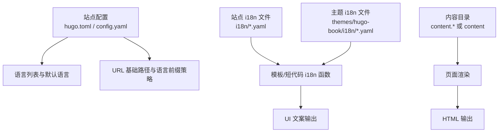
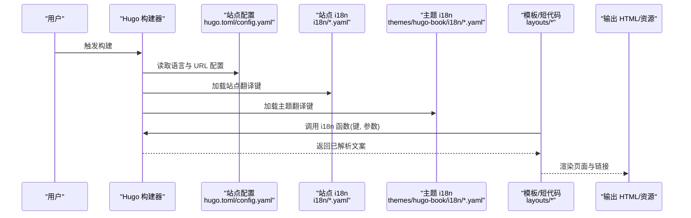
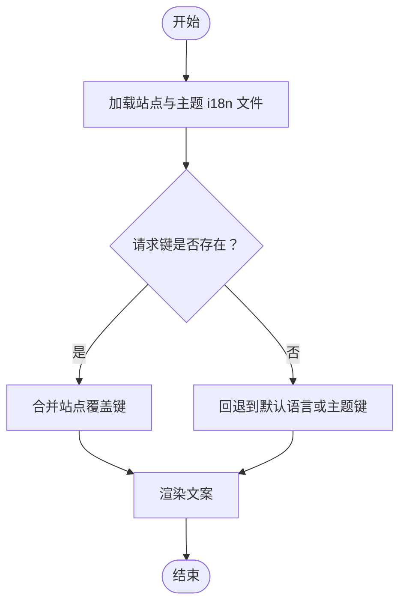
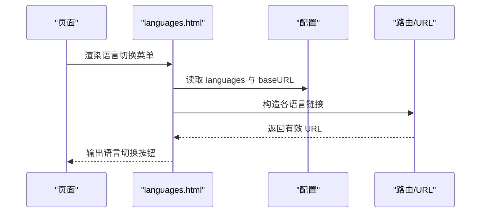
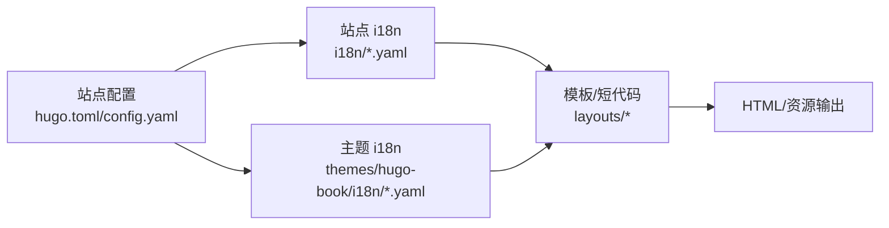

# 国际化系统

<cite>
**本文引用的文件**   
- [hugo.toml](file://hugo.toml)
- [config.yaml](file://config.yaml)
- [i18n/zh.yaml](file://i18n/zh.yaml)
- [i18n/en.yaml](file://i18n/en.yaml)
- [layouts/partials/docs/languages.html](file://layouts/partials/docs/languages.html)
- [layouts/shortcodes/i18n.html](file://layouts/shortcodes/i18n.html)
- [content/_index.md](file://content/_index.md)
- [content/docs/_index.md](file://content/docs/_index.md)
- [themes/hugo-book/i18n/zh.yaml](file://themes/hugo-book/i18n/zh.yaml)
- [themes/hugo-book/i18n/en.yaml](file://themes/hugo-book/i18n/en.yaml)
- [themes/hugo-book/layouts/partials/docs/languages.html](file://themes/hugo-book/layouts/partials/docs/languages.html)
- [themes/hugo-book/layouts/shortcodes/i18n.html](file://themes/hugo-book/layouts/shortcodes/i18n.html)
</cite>

## 目录
1. [简介](#简介)
2. [项目结构](#项目结构)
3. [核心组件](#核心组件)
4. [架构总览](#架构总览)
5. [详细组件分析](#详细组件分析)
6. [依赖关系分析](#依赖关系分析)
7. [性能考虑](#性能考虑)
8. [故障排查指南](#故障排查指南)
9. [结论](#结论)
10. [附录](#附录)

## 简介
本技术文档围绕 Hugo 多语言（i18n）体系，系统化阐述以下内容：
- 多语言内容的组织与管理方法：i18n 目录结构、翻译文件格式与键值映射机制。
- Hugo 的多语言配置：语言切换、默认语言设置、URL 路径管理。
- 主题中的国际化实现：预置翻译文件与自定义翻译添加方法。
- 内容本地化最佳实践：日期时间格式化、数字格式、文本方向等。
- 多语言 SEO 优化与站点地图生成配置。

## 项目结构
本项目采用“站点级 i18n + 主题级 i18n”的双层结构：
- 站点级 i18n：位于根目录 i18n，用于覆盖或扩展主题的翻译键。
- 主题级 i18n：位于 themes/hugo-book/i18n，提供主题 UI 的预置翻译。
- 模板与短代码：通过 layouts 下的 partials 与 shortcodes 调用 i18n 函数渲染文案。
- 内容组织：content 下按语言子目录（如 content.en、content.zh）存放对应语言的内容；若未启用语言前缀，则使用单语内容并配合 i18n 键进行界面文案本地化。

图表来源
- [hugo.toml:1-200](file://hugo.toml#L1-L200)
- [config.yaml:1-200](file://config.yaml#L1-L200)
- [i18n/zh.yaml:1-200](file://i18n/zh.yaml#L1-L200)
- [i18n/en.yaml:1-200](file://i18n/en.yaml#L1-L200)
- [themes/hugo-book/i18n/zh.yaml:1-200](file://themes/hugo-book/i18n/zh.yaml#L1-L200)
- [themes/hugo-book/i18n/en.yaml:1-200](file://themes/hugo-book/i18n/en.yaml#L1-L200)

章节来源
- [hugo.toml:1-200](file://hugo.toml#L1-L200)
- [config.yaml:1-200](file://config.yaml#L1-L200)

## 核心组件
- 站点配置（hugo.toml / config.yaml）
  - 定义 languages 列表、defaultContentLanguage、languageCode、baseURL 等关键项，控制语言优先级、默认语言与 URL 路径策略。
- 站点 i18n 文件（i18n/*.yaml）
  - 以 YAML 形式维护键值对，供模板与短代码通过 i18n 函数解析输出。
- 主题 i18n 文件（themes/hugo-book/i18n/*.yaml）
  - 提供主题 UI 文案的默认翻译，站点可覆盖同名键以实现定制。
- 模板与短代码
  - layouts/partials/docs/languages.html：语言切换入口。
  - layouts/shortcodes/i18n.html：在 Markdown 中通过短代码插入翻译文案。

章节来源
- [hugo.toml:1-200](file://hugo.toml#L1-L200)
- [config.yaml:1-200](file://config.yaml#L1-L200)
- [i18n/zh.yaml:1-200](file://i18n/zh.yaml#L1-L200)
- [i18n/en.yaml:1-200](file://i18n/en.yaml#L1-L200)
- [themes/hugo-book/i18n/zh.yaml:1-200](file://themes/hugo-book/i18n/zh.yaml#L1-L200)
- [themes/hugo-book/i18n/en.yaml:1-200](file://themes/hugo-book/i18n/en.yaml#L1-L200)
- [layouts/partials/docs/languages.html:1-200](file://layouts/partials/docs/languages.html#L1-L200)
- [layouts/shortcodes/i18n.html:1-200](file://layouts/shortcodes/i18n.html#L1-L200)

## 架构总览
下图展示从配置到渲染的关键流程：Hugo 读取配置与 i18n 文件，模板与短代码通过 i18n 函数解析键值，最终输出带语言信息的 HTML 与资源。

图表来源
- [hugo.toml:1-200](file://hugo.toml#L1-L200)
- [config.yaml:1-200](file://config.yaml#L1-L200)
- [i18n/zh.yaml:1-200](file://i18n/zh.yaml#L1-L200)
- [i18n/en.yaml:1-200](file://i18n/en.yaml#L1-L200)
- [themes/hugo-book/i18n/zh.yaml:1-200](file://themes/hugo-book/i18n/zh.yaml#L1-L200)
- [themes/hugo-book/i18n/en.yaml:1-200](file://themes/hugo-book/i18n/en.yaml#L1-L200)
- [layouts/partials/docs/languages.html:1-200](file://layouts/partials/docs/languages.html#L1-L200)
- [layouts/shortcodes/i18n.html:1-200](file://layouts/shortcodes/i18n.html#L1-L200)

## 详细组件分析

### 组件一：Hugo 多语言配置（languages、默认语言、URL 路径）
- 语言列表与默认语言
  - 通过 languages 数组声明支持的语言，并指定 defaultContentLanguage 作为默认语言。
  - languageCode 用于为各语言设置 RFC 5646 语言代码。
- URL 路径管理
  - baseURL 与 per-language baseURL 决定站点根路径。
  - 是否使用语言前缀由配置与内容目录命名约定共同决定（例如 content.en、content.zh）。
- 推荐实践
  - 明确 defaultContentLanguageDir 与 contentDir 的关系，避免路径歧义。
  - 为每种语言配置独立的 baseURL，便于部署到不同子域或子路径。

章节来源
- [hugo.toml:1-200](file://hugo.toml#L1-L200)
- [config.yaml:1-200](file://config.yaml#L1-L200)

### 组件二：i18n 目录结构与键值映射
- 目录结构
  - 站点级：i18n/<lang>.yaml（如 zh.yaml、en.yaml）。
  - 主题级：themes/hugo-book/i18n/<lang>.yaml。
- 文件格式与键值映射
  - YAML 键值对，键名需与模板/短代码中使用的键一致。
  - 站点 i18n 会覆盖主题同名键，从而实现局部定制。
- 使用方式
  - 模板中使用 i18n 函数传入键名与可选参数。
  - 短代码 i18n 可在 Markdown 中直接引用键名。

图表来源
- [i18n/zh.yaml:1-200](file://i18n/zh.yaml#L1-L200)
- [i18n/en.yaml:1-200](file://i18n/en.yaml#L1-L200)
- [themes/hugo-book/i18n/zh.yaml:1-200](file://themes/hugo-book/i18n/zh.yaml#L1-L200)
- [themes/hugo-book/i18n/en.yaml:1-200](file://themes/hugo-book/i18n/en.yaml#L1-L200)
- [layouts/shortcodes/i18n.html:1-200](file://layouts/shortcodes/i18n.html#L1-L200)

章节来源
- [i18n/zh.yaml:1-200](file://i18n/zh.yaml#L1-L200)
- [i18n/en.yaml:1-200](file://i18n/en.yaml#L1-L200)
- [themes/hugo-book/i18n/zh.yaml:1-200](file://themes/hugo-book/i18n/zh.yaml#L1-L200)
- [themes/hugo-book/i18n/en.yaml:1-200](file://themes/hugo-book/i18n/en.yaml#L1-L200)
- [layouts/shortcodes/i18n.html:1-200](file://layouts/shortcodes/i18n.html#L1-L200)

### 组件三：语言切换与导航（partials/languages）
- 功能说明
  - 根据当前页面语言与可用语言列表，生成语言切换链接。
  - 链接目标遵循配置的 baseURL 与语言前缀策略。
- 关键点
  - 需要确保每篇内容在各语言版本均存在，否则切换可能回退至默认语言。
  - 建议为每个语言页面提供 rel="alternate" 与 hreflang 元信息以提升 SEO。

图表来源
- [layouts/partials/docs/languages.html:1-200](file://layouts/partials/docs/languages.html#L1-L200)
- [hugo.toml:1-200](file://hugo.toml#L1-L200)
- [config.yaml:1-200](file://config.yaml#L1-L200)

章节来源
- [layouts/partials/docs/languages.html:1-200](file://layouts/partials/docs/languages.html#L1-L200)

### 组件四：内容本地化与 SEO
- 内容组织
  - 多语言内容建议使用 content.<lang>/ 目录结构，与语言配置保持一致。
  - 若仅使用单语内容，可通过 i18n 键完成界面文案本地化。
- SEO 优化
  - 为每个语言页面设置正确的 lang 属性与 hreflang 互链。
  - 站点地图应包含所有语言的 URL，并确保 canonical 指向当前语言版本。
- 本地化细节
  - 日期时间与数字格式：建议在模板中根据当前语言选择相应格式化逻辑。
  - 文本方向：根据语言特性设置 dir 属性（如阿拉伯文等 RTL 场景）。

章节来源
- [content/_index.md:1-200](file://content/_index.md#L1-L200)
- [content/docs/_index.md:1-200](file://content/docs/_index.md#L1-L200)

## 依赖关系分析
- 配置依赖
  - hugo.toml 与 config.yaml 共同驱动语言与 URL 行为，二者需保持一致性。
- i18n 依赖
  - 站点 i18n 覆盖主题 i18n 同名键，形成“主题默认 + 站点定制”的分层。
- 模板依赖
  - languages.html 与 i18n 短代码强依赖配置与 i18n 文件，缺失键将导致回退或空值。

图表来源
- [hugo.toml:1-200](file://hugo.toml#L1-L200)
- [config.yaml:1-200](file://config.yaml#L1-L200)
- [i18n/zh.yaml:1-200](file://i18n/zh.yaml#L1-L200)
- [i18n/en.yaml:1-200](file://i18n/en.yaml#L1-L200)
- [themes/hugo-book/i18n/zh.yaml:1-200](file://themes/hugo-book/i18n/zh.yaml#L1-L200)
- [themes/hugo-book/i18n/en.yaml:1-200](file://themes/hugo-book/i18n/en.yaml#L1-L200)
- [layouts/partials/docs/languages.html:1-200](file://layouts/partials/docs/languages.html#L1-L200)
- [layouts/shortcodes/i18n.html:1-200](file://layouts/shortcodes/i18n.html#L1-L200)

章节来源
- [hugo.toml:1-200](file://hugo.toml#L1-L200)
- [config.yaml:1-200](file://config.yaml#L1-L200)

## 性能考虑
- i18n 文件体积
  - 合理拆分与按需加载，避免单个 i18n 文件过大。
- 构建时解析
  - 减少不必要的 i18n 键查询，尽量复用已解析结果。
- 缓存策略
  - 静态资源与页面缓存结合，降低重复渲染开销。

## 故障排查指南
- 现象：语言切换无效或跳转错误
  - 检查 languages 配置与 baseURL 设置是否匹配。
  - 确认目标语言页面是否存在，否则可能回退至默认语言。
- 现象：文案显示为空或回退到英文
  - 核对 i18n 键名是否与模板/短代码一致。
  - 确认站点 i18n 是否覆盖了主题键且语法正确。
- 现象：SEO 标签缺失
  - 检查模板是否正确输出 lang 与 hreflang。
  - 验证站点地图是否包含所有语言 URL。

章节来源
- [layouts/partials/docs/languages.html:1-200](file://layouts/partials/docs/languages.html#L1-L200)
- [layouts/shortcodes/i18n.html:1-200](file://layouts/shortcodes/i18n.html#L1-L200)
- [i18n/zh.yaml:1-200](file://i18n/zh.yaml#L1-L200)
- [i18n/en.yaml:1-200](file://i18n/en.yaml#L1-L200)
- [themes/hugo-book/i18n/zh.yaml:1-200](file://themes/hugo-book/i18n/zh.yaml#L1-L200)
- [themes/hugo-book/i18n/en.yaml:1-200](file://themes/hugo-book/i18n/en.yaml#L1-L200)

## 结论
通过分层化的 i18n 设计与清晰的配置策略，本项目实现了可扩展的多语言能力。站点级 i18n 覆盖主题默认文案，模板与短代码统一通过 i18n 函数获取文案，保证了可维护性与一致性。配合合理的 URL 路径管理与 SEO 优化，可为用户提供良好的多语言体验。

## 附录
- 术语
  - i18n：国际化（Internationalization），指将产品适配多种语言与文化的过程。
  - l10n：本地化（Localization），指针对特定地区与语言的具体实现。
- 参考
  - Hugo 官方文档关于多语言与 i18n 的配置与用法。
  - 主题 hugo-book 的 i18n 示例与模板实现。