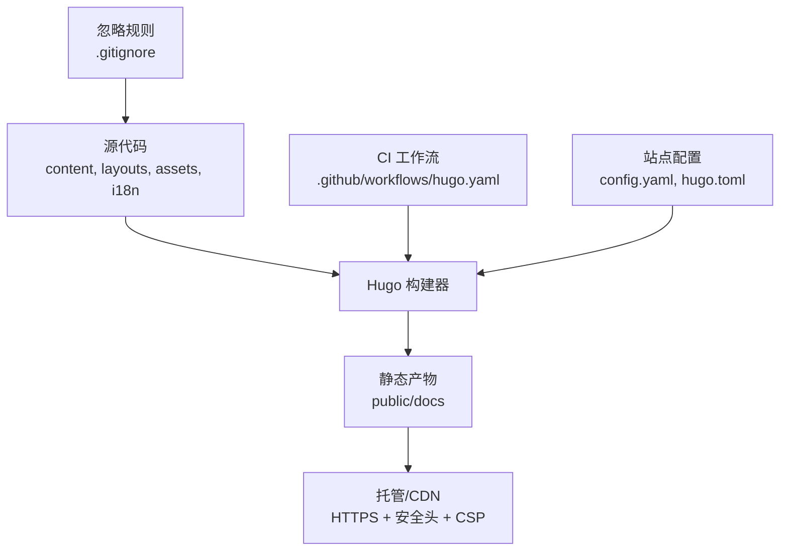
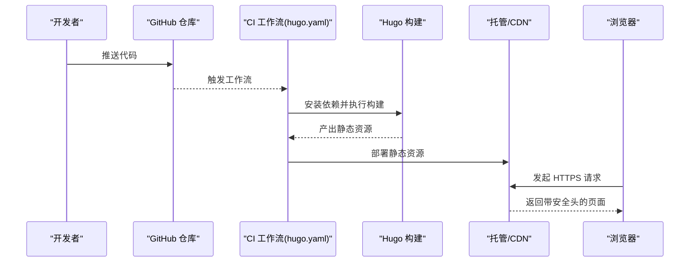
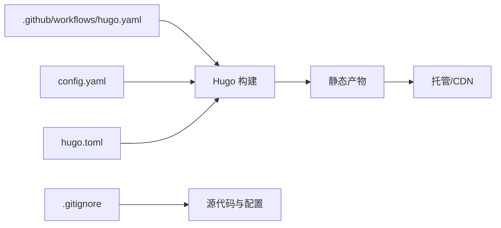

# 安全配置

<cite>
**本文引用的文件**   
- [hugo.yaml](file://.github/workflows/hugo.yaml)
- [config.yaml](file://config.yaml)
- [hugo.toml](file://hugo.toml)
- [.gitignore](file://.gitignore)
- [README.md](file://README.md)
</cite>

## 目录
1. [简介](#简介)
2. [项目结构](#项目结构)
3. [核心组件](#核心组件)
4. [架构总览](#架构总览)
5. [详细组件分析](#详细组件分析)
6. [依赖关系分析](#依赖关系分析)
7. [性能考虑](#性能考虑)
8. [故障排查指南](#故障排查指南)
9. [结论](#结论)
10. [附录](#附录)

## 简介
本文件面向静态网站的安全加固，围绕 HTTPS、安全响应头、内容安全策略（CSP）、输入验证与输出编码、依赖包安全管理、CI/CD 流水线中的安全检查、敏感信息与密钥保护、以及安全监控与威胁检测等方面提供系统化实践建议。本项目为基于 Hugo 的静态站点，构建产物为纯静态资源，因此安全边界主要落在“构建期”和“托管/CDN 层”。

## 项目结构
仓库采用典型的 Hugo 主题化结构：源码位于 content、layouts、assets、i18n 等目录；构建产物位于 public 或 docs；CI 工作流定义在 .github/workflows；站点配置集中在 config.yaml 与 hugo.toml。

图表来源
- [hugo.yaml](file://.github/workflows/hugo.yaml)
- [config.yaml](file://config.yaml)
- [hugo.toml](file://hugo.toml)
- [.gitignore](file://.gitignore)

章节来源
- [README.md](file://README.md)

## 核心组件
- 构建与发布流水线：通过 GitHub Actions 触发 Hugo 构建并部署静态资源。
- 站点配置：包含语言、主题、菜单、搜索、SEO 等设置，部分与安全相关（如是否启用缓存、是否生成 sitemap）。
- 版本控制与忽略规则：防止敏感信息进入仓库。
- 托管/CDN 层：负责 HTTPS、安全响应头、CSP、缓存与访问控制。

章节来源
- [hugo.yaml](file://.github/workflows/hugo.yaml)
- [config.yaml](file://config.yaml)
- [hugo.toml](file://hugo.toml)
- [.gitignore](file://.gitignore)

## 架构总览
下图展示从代码提交到线上安全的端到端流程，强调在 CI 中嵌入安全扫描，在托管/CDN 层统一实施 HTTPS、安全头与 CSP。

图表来源
- [hugo.yaml](file://.github/workflows/hugo.yaml)

## 详细组件分析

### 1) HTTPS 与传输安全
- 强制 HTTPS：在托管/CDN 层开启强制重定向至 HTTPS，禁用明文 HTTP。
- TLS 版本与套件：仅允许现代 TLS 版本与强加密套件，关闭过时协议。
- HSTS：启用严格传输安全，指定最大有效期与子域策略。
- 证书管理：使用自动化证书颁发与续期，避免手动过期风险。

章节来源
- [hugo.yaml](file://.github/workflows/hugo.yaml)

### 2) 安全响应头
建议在托管/CDN 层统一添加以下头部（示例值需按业务调整）：
- Strict-Transport-Security：启用 HSTS。
- X-Content-Type-Options: nosniff
- X-Frame-Options: DENY 或 SAMEORIGIN
- Referrer-Policy: strict-origin-when-cross-origin
- Permissions-Policy: 限制不必要能力（如 camera、microphone 等）
- Content-Security-Policy：见下一节

章节来源
- [hugo.yaml](file://.github/workflows/hugo.yaml)

### 3) 内容安全策略（CSP）
- 原则：最小权限白名单，仅允许必要的脚本、样式、图片、字体与 API 域名。
- 指令要点：
  - default-src 'self'
  - script-src / style-src / img-src / font-src 限定来源
  - object-src 'none'
  - frame-ancestors 'none' 或同源
  - base-uri / form-action 限制
- 动态注入：尽量避免 inline 脚本与 eval；如需第三方服务，将其域名加入白名单。
- 报告与调试：先以 report-only 模式运行，收集违规报告后再收紧策略。

章节来源
- [hugo.yaml](file://.github/workflows/hugo.yaml)

### 4) 输入验证与输出编码（防 XSS/注入）
- 输入侧：对任何用户可控输入进行服务端校验与过滤（表单、URL 参数、上传文件名等），遵循“只接受预期格式”的原则。
- 输出侧：对所有渲染内容进行上下文相关的转义（HTML、JS、CSS、URL、属性），避免直接拼接未转义数据。
- 富文本：若必须支持富文本，使用成熟的白名单库进行清理，并定期更新规则。
- 模板安全：确保模板引擎默认启用自动转义，避免绕过机制。

章节来源
- [hugo.yaml](file://.github/workflows/hugo.yaml)

### 5) 依赖包安全管理
- 锁定版本：使用锁文件固定依赖版本，减少漂移风险。
- 漏洞扫描：在 CI 中集成依赖漏洞扫描（如 npm audit、pip-audit、go vet 等，视技术栈而定）。
- 更新策略：定期拉取上游更新，结合自动化 PR 与人工评审。
- 许可证合规：检查第三方组件许可证，避免引入不兼容或高风险许可。

章节来源
- [hugo.yaml](file://.github/workflows/hugo.yaml)

### 6) CI/CD 流水线中的安全检查
- 代码质量：语法检查、格式化、lint、单元测试。
- 安全扫描：SAST/DAST、依赖漏洞扫描、Secrets 扫描。
- 制品签名与完整性：对构建产物进行签名与校验。
- 环境隔离：使用最小权限令牌与临时凭据，禁止硬编码密钥。
- 审计日志：记录关键步骤与失败原因，便于回溯。

章节来源
- [hugo.yaml](file://.github/workflows/hugo.yaml)

### 7) 敏感信息管理与密钥保护
- 绝不提交密钥：将密钥、令牌、私钥放入环境变量或密钥管理服务，并在 .gitignore 中排除。
- 最小暴露面：按需授予最小权限，定期轮换。
- 本地开发：使用 .env 文件并加入忽略列表，避免误提交。
- 审计与告警：对异常访问与泄露行为建立告警。

章节来源
- [.gitignore](file://.gitignore)

### 8) 安全监控与威胁检测
- 访问日志：集中采集并分析异常请求（高频 4xx/5xx、异常 UA、路径遍历等）。
- WAF/IPS：在边缘层启用 Web 应用防火墙与入侵防护。
- 基线与告警：建立正常流量基线，偏离时触发告警。
- 事件响应：制定预案，明确处置流程与回滚策略。

章节来源
- [hugo.yaml](file://.github/workflows/hugo.yaml)

## 依赖关系分析
- 工作流与构建：工作流文件驱动 Hugo 构建与部署，是安全控制的入口点之一。
- 配置与构建：站点配置影响构建产物与元数据，间接影响安全（如是否生成 sitemap、是否启用缓存）。
- 版本控制：忽略规则保障敏感信息不出仓。

图表来源
- [hugo.yaml](file://.github/workflows/hugo.yaml)
- [config.yaml](file://config.yaml)
- [hugo.toml](file://hugo.toml)
- [.gitignore](file://.gitignore)

章节来源
- [hugo.yaml](file://.github/workflows/hugo.yaml)
- [config.yaml](file://config.yaml)
- [hugo.toml](file://hugo.toml)
- [.gitignore](file://.gitignore)

## 性能考虑
- 静态资源缓存：合理设置 Cache-Control 与 ETag，提升加载速度。
- 压缩与合并：启用 Gzip/Brotli，减少体积。
- 资源指纹：对静态资源加哈希后缀，利于长期缓存与快速失效。
- 边缘缓存：利用 CDN 缓存热点资源，降低源站压力。

[本节为通用指导，无需特定文件引用]

## 故障排查指南
- 构建失败：检查工作流日志，确认依赖安装与构建命令是否正确。
- 安全头缺失：检查托管/CDN 的响应头配置是否生效。
- CSP 报错：优先以 report-only 模式定位问题，逐步收紧策略。
- 依赖漏洞：根据扫描报告评估风险等级，必要时降级或替换依赖。
- 密钥泄露：立即轮换受影响凭据，审查历史提交与分支，清理泄露物。

章节来源
- [hugo.yaml](file://.github/workflows/hugo.yaml)

## 结论
对于静态站点，安全重心在于“构建期可重复、可审计”和“托管/CDN 层统一治理”。通过 CI 内嵌安全扫描、严格的依赖与密钥管理、完善的 HTTPS 与安全头/CSP 策略，以及持续的监控与响应，可以显著提升整体安全性与可维护性。

[本节为总结性内容，无需特定文件引用]

## 附录
- 参考清单（可按需落地）：
  - 强制 HTTPS 与 HSTS
  - 安全响应头集合
  - CSP 白名单策略
  - 输入验证与输出编码规范
  - 依赖漏洞扫描与更新流程
  - Secrets 扫描与最小权限令牌
  - 访问日志与 WAF 策略
  - 事件响应与回滚预案

[本节为补充说明，无需特定文件引用]