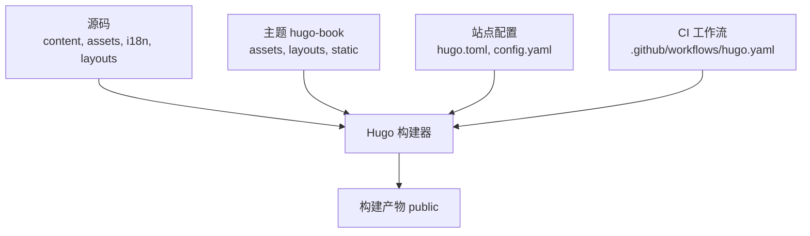
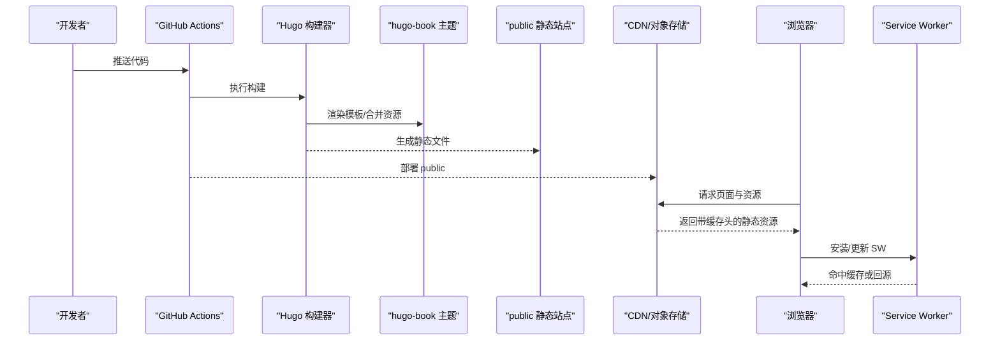
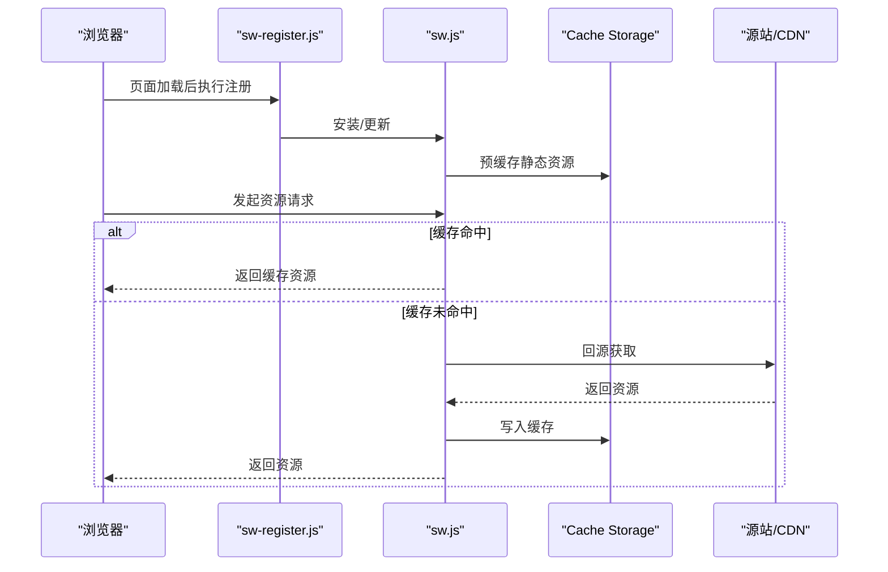
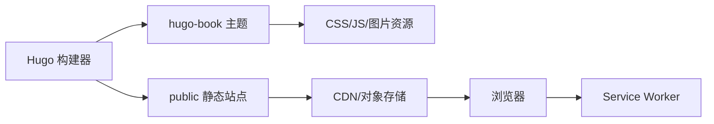

# 性能优化

<cite>
**本文引用的文件**   
- [hugo.toml](file://hugo.toml)
- [config.yaml](file://config.yaml)
- [sw.js](file://themes/hugo-book/assets/sw.js)
- [sw-register.js](file://themes/hugo-book/assets/sw-register.js)
- [index.html](file://layouts/_default/baseof.html)
- [github-workflow-hugo-yaml](file://.github/workflows/hugo.yaml)
</cite>

## 目录
1. [简介](#简介)
2. [项目结构](#项目结构)
3. [核心组件](#核心组件)
4. [架构总览](#架构总览)
5. [详细组件分析](#详细组件分析)
6. [依赖分析](#依赖分析)
7. [性能考量](#性能考量)
8. [故障排查指南](#故障排查指南)
9. [结论](#结论)
10. [附录](#附录)

## 简介
本技术文档面向基于 Hugo + hugo-book 主题的静态站点，聚焦于构建期与运行期的性能优化实践。内容覆盖资源压缩、缓存策略、懒加载、CSS/JS 优化（代码分割、Tree Shaking、压缩工具配置）、图片优化（WebP、响应式、CDN）、Service Worker 离线缓存与 PWA 支持，以及页面加载性能监控与分析方法。文档同时给出浏览器缓存与 HTTP 头配置的最佳实践建议，帮助在现有仓库基础上持续提升首屏与整体加载性能。

## 项目结构
该仓库采用 Hugo 标准目录组织：
- 源码与内容：content、assets、i18n、layouts、static
- 主题：themes/hugo-book（包含样式、脚本、模板与 Service Worker）
- 构建产物：public（Hugo 生成的静态站点）
- 构建流水线：.github/workflows/hugo.yaml
- 站点配置：hugo.toml、config.yaml

图表来源
- [github-workflow-hugo-yaml](file://.github/workflows/hugo.yaml)
- [hugo.toml](file://hugo.toml)
- [config.yaml](file://config.yaml)

章节来源
- [hugo.toml](file://hugo.toml)
- [config.yaml](file://config.yaml)
- [github-workflow-hugo-yaml](file://.github/workflows/hugo.yaml)

## 核心组件
- 构建配置与输出
  - Hugo 主配置与可选 YAML 配置用于控制构建行为与输出路径。
  - GitHub Actions 工作流负责触发构建并产出 public 目录。
- 主题与前端资源
  - hugo-book 主题提供基础 CSS/JS、搜索与 Service Worker 注册逻辑。
  - 站点模板 baseof.html 作为 HTML 骨架，注入全局资源引用。
- 运行时能力
  - Service Worker 脚本 sw.js 与注册脚本 sw-register.js 提供离线缓存与 PWA 相关能力的基础实现。

章节来源
- [hugo.toml](file://hugo.toml)
- [config.yaml](file://config.yaml)
- [github-workflow-hugo-yaml](file://.github/workflows/hugo.yaml)
- [sw.js](file://themes/hugo-book/assets/sw.js)
- [sw-register.js](file://themes/hugo-book/assets/sw-register.js)
- [index.html](file://layouts/_default/baseof.html)

## 架构总览
下图展示从源码到最终可部署产物的关键流程，以及运行期浏览器与服务端的交互要点。

图表来源
- [github-workflow-hugo-yaml](file://.github/workflows/hugo.yaml)
- [hugo.toml](file://hugo.toml)
- [config.yaml](file://config.yaml)
- [sw.js](file://themes/hugo-book/assets/sw.js)
- [sw-register.js](file://themes/hugo-book/assets/sw-register.js)

## 详细组件分析

### 构建与输出优化（Hugo 与 CI）
- 目标
  - 通过构建期优化减少资源体积、提升缓存命中率，缩短冷启动时间。
- 关键动作
  - 启用 Hugo 内置的资产管道与资源优化（如 CSS/JS 压缩、哈希化）。
  - 在 CI 中固定 Hugo 版本，确保构建可重复与稳定。
  - 将 public 目录直接部署至 CDN/对象存储，利用其边缘缓存。
- 建议
  - 使用 Hugo 的资源处理链对 CSS/JS 进行压缩与混淆。
  - 为静态资源开启长缓存与强校验（文件名哈希），配合 CDN 缓存失效策略。
  - 在 CI 中并行化依赖安装与构建步骤，缩短流水线时长。

章节来源
- [hugo.toml](file://hugo.toml)
- [config.yaml](file://config.yaml)
- [github-workflow-hugo-yaml](file://.github/workflows/hugo.yaml)

### 主题与模板层优化（baseof.html 与 hugo-book）
- 目标
  - 减少首屏阻塞资源，提高可交互时间。
- 关键动作
  - 在 baseof.html 中按需引入关键 CSS，非关键样式异步加载。
  - 将非关键 JS 标记为 defer 或 async，避免阻塞解析。
  - 预连接与预取关键域名与字体资源。
- 建议
  - 使用 preload/prefetch 精准声明关键资源。
  - 分离首屏与非首屏资源，降低 LCP 与 TBT。
  - 对第三方库进行本地化与最小化打包，减少外部依赖。

章节来源
- [index.html](file://layouts/_default/baseof.html)

### Service Worker 与 PWA（sw.js 与 sw-register.js）
- 目标
  - 提供离线访问、弱网加速与后台同步等能力，提升用户体验与稳定性。
- 关键动作
  - 在 sw-register.js 中注册 SW，并在首次加载时完成安装与激活。
  - 在 sw.js 中定义缓存策略：静态资源走 Cache First，动态内容走 Network First 或 Stale-While-Revalidate。
  - 设置合理的缓存命名空间与版本号，便于灰度与回滚。
- 建议
  - 对 HTML 页面采用网络优先策略，保证内容新鲜度。
  - 对 JS/CSS/字体等资源采用强缓存+版本化策略。
  - 监听 fetch 事件，对大资源进行分片与断点续传（视业务需要）。

图表来源
- [sw-register.js](file://themes/hugo-book/assets/sw-register.js)
- [sw.js](file://themes/hugo-book/assets/sw.js)

章节来源
- [sw.js](file://themes/hugo-book/assets/sw.js)
- [sw-register.js](file://themes/hugo-book/assets/sw-register.js)

### CSS/JS 优化（代码分割、Tree Shaking、压缩）
- 目标
  - 减少传输体积与解析开销，提升首屏与可交互速度。
- 关键动作
  - 启用 Tree Shaking，移除未使用的导出与死代码。
  - 按路由或功能模块进行代码分割，按需加载。
  - 使用压缩工具（如 Terser/UglifyJS、cssnano）进行压缩与混淆。
- 建议
  - 将公共依赖抽离为独立 chunk，利用浏览器长期缓存。
  - 对大型第三方库进行按需引入与替换轻量替代方案。
  - 对关键 CSS 内联，其余异步加载；对关键 JS 使用 defer。

章节来源
- [hugo.toml](file://hugo.toml)
- [config.yaml](file://config.yaml)

### 图片资源优化（WebP、响应式、CDN）
- 目标
  - 降低图片体积与带宽消耗，提升渲染效率。
- 关键动作
  - 在构建期将常用格式转换为 WebP/AVIF，并提供降级回退。
  - 使用 srcset/sizes 实现响应式图片，按设备像素比与视口尺寸选择合适分辨率。
  - 借助 CDN 的图像转码与自适应裁剪能力。
- 建议
  - 对大图进行有损压缩与渐进式加载。
  - 对图标类资源使用 SVG 或 Icon Font。
  - 结合懒加载与 IntersectionObserver，延迟非首屏图片。

章节来源
- [hugo.toml](file://hugo.toml)
- [config.yaml](file://config.yaml)

### 缓存策略与 HTTP 头配置
- 目标
  - 最大化浏览器与 CDN 缓存命中率，减少重复请求。
- 关键动作
  - 为静态资源设置长缓存（如一年）并附带强校验（ETag/Last-Modified）。
  - 对 HTML 页面设置较短缓存或禁用缓存，确保内容及时更新。
  - 使用 Cache-Control、Expires、Vary 等头部精细化控制缓存。
- 建议
  - 在 CDN/对象存储层面统一配置缓存规则。
  - 对版本化资源（含哈希）使用强缓存，对无版本资源谨慎设置。
  - 针对跨域资源设置合适的 CORS 与 Vary 头。

章节来源
- [hugo.toml](file://hugo.toml)
- [config.yaml](file://config.yaml)

### 页面加载性能监控与分析
- 目标
  - 建立持续的性能观测体系，定位瓶颈并指导优化。
- 关键动作
  - 接入 Core Web Vitals 上报（LCP、FID/INP、CLS），结合埋点统计。
  - 使用 Lighthouse CI 在 PR 阶段进行性能回归检测。
  - 在生产环境采集真实用户指标（RUM），关注不同地区与设备的差异。
- 建议
  - 设定性能预算与阈值，超阈自动告警。
  - 定期生成性能报告，跟踪趋势与回归。
  - 结合网络瀑布图与火焰图定位具体资源与脚本问题。

章节来源
- [github-workflow-hugo-yaml](file://.github/workflows/hugo.yaml)

## 依赖分析
- 构建期依赖
  - Hugo CLI 与 hugo-book 主题版本需锁定，确保构建一致性与可复现性。
- 运行期依赖
  - 浏览器原生 API（Service Worker、Cache Storage、IntersectionObserver）。
  - CDN/对象存储提供的缓存与转码能力。
- 潜在风险
  - 主题升级可能改变资源路径与注入方式，需回归测试。
  - SW 策略变更需考虑灰度与回滚机制。

图表来源
- [github-workflow-hugo-yaml](file://.github/workflows/hugo.yaml)
- [hugo.toml](file://hugo.toml)
- [config.yaml](file://config.yaml)
- [sw.js](file://themes/hugo-book/assets/sw.js)
- [sw-register.js](file://themes/hugo-book/assets/sw-register.js)

章节来源
- [github-workflow-hugo-yaml](file://.github/workflows/hugo.yaml)
- [hugo.toml](file://hugo.toml)
- [config.yaml](file://config.yaml)
- [sw.js](file://themes/hugo-book/assets/sw.js)
- [sw-register.js](file://themes/hugo-book/assets/sw-register.js)

## 性能考量
- 首屏优化
  - 关键 CSS 内联、关键 JS defer、预连接关键域名、预取关键资源。
- 资源体积
  - 启用压缩与混淆、按需加载、移除冗余依赖、图片转换与压缩。
- 缓存与网络
  - 长缓存+版本化、HTTP 头精细化、CDN 就近分发与边缘缓存。
- 可维护性
  - 构建可复现、性能回归检测、指标可视化与告警。

[本节为通用指导，不直接分析具体文件]

## 故障排查指南
- 构建失败
  - 检查 Hugo 版本与工作流中的环境变量与缓存键。
  - 确认主题依赖与资源路径是否正确。
- 缓存异常
  - 核对 CDN/对象存储的缓存规则与 TTL 配置。
  - 验证资源是否携带正确的 Cache-Control 与 ETag。
- Service Worker 问题
  - 检查注册脚本是否成功加载与执行。
  - 查看 SW 日志与缓存命名空间，确认策略是否符合预期。
- 性能退化
  - 使用 Lighthouse CI 对比历史数据，定位新增瓶颈。
  - 结合 RUM 数据观察不同地域与设备的表现差异。

章节来源
- [github-workflow-hugo-yaml](file://.github/workflows/hugo.yaml)
- [sw.js](file://themes/hugo-book/assets/sw.js)
- [sw-register.js](file://themes/hugo-book/assets/sw-register.js)

## 结论
通过在构建期启用资源压缩与版本化、在模板层优化资源加载顺序、在服务端与 CDN 层完善缓存策略，并结合 Service Worker 提供离线与弱网能力，可以显著提升静态站点的加载性能与用户体验。配合完善的性能监控与回归检测，可在迭代过程中持续保持高性能基线。

[本节为总结性内容，不直接分析具体文件]

## 附录
- 术语
  - LCP：最大内容绘制
  - INP/FID：交互到下一次绘制/首次输入延迟
  - CLS：累积布局偏移
  - RUM：真实用户监控
- 参考实践清单
  - 构建期：启用压缩、哈希化、按需加载、图片转换。
  - 运行期：预连接/预取、defer/async、懒加载、SW 缓存策略。
  - 服务端/CDN：长缓存+版本化、HTML 短缓存、CORS/Vary 正确配置。
  - 监控：Core Web Vitals、Lighthouse CI、RUM 指标与告警。

[本节为补充信息，不直接分析具体文件]