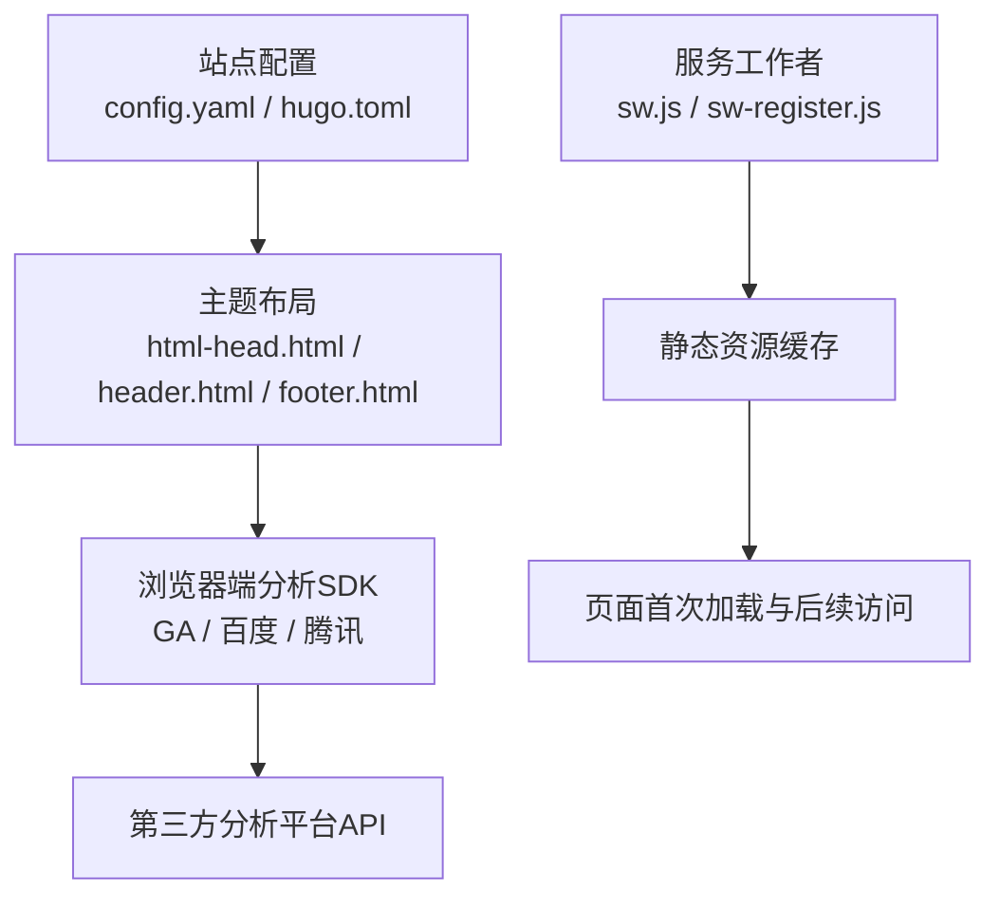
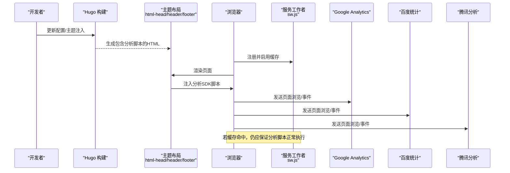
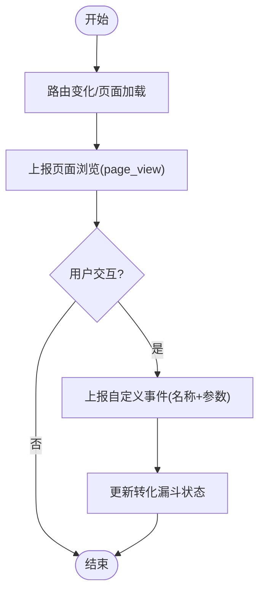
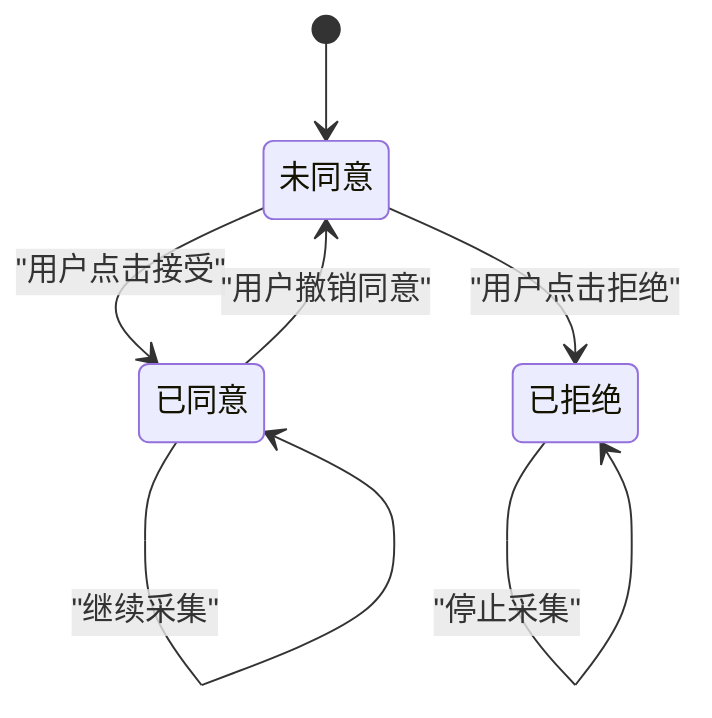
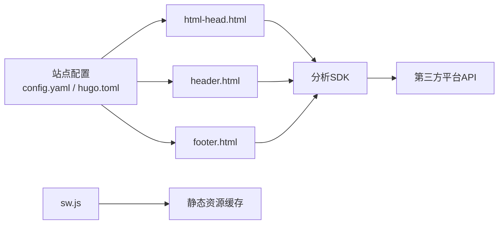

# 数据分析集成

<cite>
**本文引用的文件**   
- [config.yaml](file://config.yaml)
- [hugo.toml](file://hugo.toml)
- [layouts/partials/docs/html-head.html](file://themes/hugo-book/layouts/partials/docs/html-head.html)
- [layouts/partials/docs/header.html](file://themes/hugo-book/layouts/partials/docs/header.html)
- [layouts/partials/docs/footer.html](file://themes/hugo-book/layouts/partials/docs/footer.html)
- [assets/sw.js](file://themes/hugo-book/assets/sw.js)
- [assets/sw-register.js](file://themes/hugo-book/assets/sw-register.js)
</cite>

## 目录
1. [简介](#简介)
2. [项目结构](#项目结构)
3. [核心组件](#核心组件)
4. [架构总览](#架构总览)
5. [详细组件分析](#详细组件分析)
6. [依赖关系分析](#依赖关系分析)
7. [性能考虑](#性能考虑)
8. [故障排查指南](#故障排查指南)
9. [结论](#结论)
10. [附录](#附录)

## 简介
本技术文档面向在基于 Hugo + hugo-book 主题的博客项目中集成第三方数据分析平台（如 Google Analytics、百度统计、腾讯分析等）的工程师与内容运营人员。文档覆盖以下目标：
- 如何在站点中安全、合规地接入主流分析工具
- 如何实现页面浏览统计、用户交互追踪与转化漏斗分析
- 隐私保护与合规要求（GDPR、Cookie 管理、用户同意机制）
- 自定义事件埋点方法与数据导出技巧
- 搭建数据分析仪表板与可视化展示方案

## 项目结构
本项目采用 Hugo 静态站点生成器，使用 hugo-book 主题。分析脚本通常通过主题的 HTML 头部或全局布局注入到所有页面；服务工作者（Service Worker）用于缓存资源，可能影响分析数据的采集时机。

图表来源
- [config.yaml](file://config.yaml)
- [hugo.toml](file://hugo.toml)
- [layouts/partials/docs/html-head.html](file://themes/hugo-book/layouts/partials/docs/html-head.html)
- [layouts/partials/docs/header.html](file://themes/hugo-book/layouts/partials/docs/header.html)
- [layouts/partials/docs/footer.html](file://themes/hugo-book/layouts/partials/docs/footer.html)
- [assets/sw.js](file://themes/hugo-book/assets/sw.js)
- [assets/sw-register.js](file://themes/hugo-book/assets/sw-register.js)

章节来源
- [config.yaml](file://config.yaml)
- [hugo.toml](file://hugo.toml)
- [layouts/partials/docs/html-head.html](file://themes/hugo-book/layouts/partials/docs/html-head.html)
- [layouts/partials/docs/header.html](file://themes/hugo-book/layouts/partials/docs/header.html)
- [layouts/partials/docs/footer.html](file://themes/hugo-book/layouts/partials/docs/footer.html)
- [assets/sw.js](file://themes/hugo-book/assets/sw.js)
- [assets/sw-register.js](file://themes/hugo-book/assets/sw-register.js)

## 核心组件
- 站点配置层
  - 站点元信息、语言、SEO 相关设置位于站点配置文件，便于集中管理分析 ID 与开关。
- 主题注入层
  - 通过主题的 html-head、header、footer 等 partials 将分析 SDK 注入到每个页面。
- 运行时层
  - 浏览器端分析 SDK 负责页面浏览、滚动、点击、表单提交等事件上报。
- 服务工作者层
  - 缓存策略可能影响首屏加载与后续请求，需确保分析脚本不被错误拦截或延迟执行。

章节来源
- [config.yaml](file://config.yaml)
- [hugo.toml](file://hugo.toml)
- [layouts/partials/docs/html-head.html](file://themes/hugo-book/layouts/partials/docs/html-head.html)
- [layouts/partials/docs/header.html](file://themes/hugo-book/layouts/partials/docs/header.html)
- [layouts/partials/docs/footer.html](file://themes/hugo-book/layouts/partials/docs/footer.html)
- [assets/sw.js](file://themes/hugo-book/assets/sw.js)
- [assets/sw-register.js](file://themes/hugo-book/assets/sw-register.js)

## 架构总览
下图展示了从站点构建到浏览器运行时的整体链路，以及分析数据流向第三方平台的流程。

图表来源
- [layouts/partials/docs/html-head.html](file://themes/hugo-book/layouts/partials/docs/html-head.html)
- [layouts/partials/docs/header.html](file://themes/hugo-book/layouts/partials/docs/header.html)
- [layouts/partials/docs/footer.html](file://themes/hugo-book/layouts/partials/docs/footer.html)
- [assets/sw.js](file://themes/hugo-book/assets/sw.js)
- [assets/sw-register.js](file://themes/hugo-book/assets/sw-register.js)

## 详细组件分析

### 站点配置与多环境管理
- 建议将各平台的分析 ID、是否启用、域名白名单等放入站点配置，便于按环境切换。
- 在主题 partials 中读取配置变量，动态注入对应 SDK 初始化代码。
- 为生产与开发环境分别设置不同的 ID 或关闭上报，避免污染测试数据。

章节来源
- [config.yaml](file://config.yaml)
- [hugo.toml](file://hugo.toml)

### 主题注入层（html-head / header / footer）
- 推荐在 html-head 中引入分析 SDK 的初始化脚本，确保在 DOM 可用前完成必要配置。
- 如需在页头或页脚触发特定事件（例如下载按钮点击），可在 header/footer 中绑定监听。
- 注意避免重复注入与冲突，统一由主题 partials 管理。

章节来源
- [layouts/partials/docs/html-head.html](file://themes/hugo-book/layouts/partials/docs/html-head.html)
- [layouts/partials/docs/header.html](file://themes/hugo-book/layouts/partials/docs/header.html)
- [layouts/partials/docs/footer.html](file://themes/hugo-book/layouts/partials/docs/footer.html)

### 服务工作者与缓存对分析的影响
- Service Worker 会缓存静态资源，可能导致分析脚本或第三方 SDK 被缓存版本接管。
- 建议在 sw.js 中对分析相关请求放行或强制网络请求，确保最新配置生效。
- 在 sw-register.js 中可加入条件逻辑，仅在用户同意后注册 SW，减少隐私风险。

章节来源
- [assets/sw.js](file://themes/hugo-book/assets/sw.js)
- [assets/sw-register.js](file://themes/hugo-book/assets/sw-register.js)

### 第三方平台集成要点

#### Google Analytics（GA4）
- 初始化：在 html-head 注入测量 ID 与默认参数（如页面标题、语言）。
- 页面浏览：SPA 路由变化时调用 page_view 事件。
- 自定义事件：为关键交互（搜索、下载、订阅）定义 event 名称与参数。
- 调试：使用 GA DebugView 验证事件上报。

章节来源
- [layouts/partials/docs/html-head.html](file://themes/hugo-book/layouts/partials/docs/html-head.html)

#### 百度统计
- 初始化：在 html-head 注入站点 ID 与基础配置。
- 页面浏览：单页应用需手动上报 pv。
- 自定义事件：为重要按钮与表单提交埋点。
- 调试：使用浏览器控制台与百度统计后台实时日志。

章节来源
- [layouts/partials/docs/html-head.html](file://themes/hugo-book/layouts/partials/docs/html-head.html)

#### 腾讯分析
- 初始化：在 html-head 注入 AppID 与基本参数。
- 页面浏览：结合路由变化上报。
- 自定义事件：针对业务关键路径进行事件标记。
- 调试：使用腾讯分析控制台的事件预览功能。

章节来源
- [layouts/partials/docs/html-head.html](file://themes/hugo-book/layouts/partials/docs/html-head.html)

### 事件追踪与用户行为分析
- 页面浏览统计
  - 在路由切换或页面加载完成后上报 page_view。
  - 记录页面标题、URL、语言、来源渠道等维度。
- 用户交互追踪
  - 为搜索框、导航菜单、下载按钮、订阅表单等元素绑定 click 事件。
  - 使用统一的埋点函数封装，避免分散逻辑。
- 转化漏斗分析
  - 定义关键步骤（进入落地页 → 填写表单 → 提交成功）。
  - 在每个步骤上报相应事件，并在平台侧构建漏斗报表。

[此图为概念流程图，无需图表来源]

### 隐私保护与合规性（GDPR、Cookie、用户同意）
- 用户同意机制
  - 在页面顶部显示 Cookie 与隐私横幅，提供“接受/拒绝”选项。
  - 仅在用户同意后初始化分析 SDK 与注册 Service Worker。
- 最小化数据采集
  - 关闭 IP 收集、禁用广告标识符、限制跨站跟踪。
- 数据保留与删除
  - 遵循平台的数据保留策略，提供用户数据删除入口。
- 合规提示
  - 在隐私政策中说明采集目的、范围、存储期限与第三方共享情况。

[此图为概念状态图，无需图表来源]

### 自定义分析事件实现方法
- 设计事件命名规范
  - 使用“模块_动作_对象”格式，如“nav_click_menu”。
- 埋点位置
  - 在主题 partials 或业务脚本中统一封装埋点函数。
- 参数设计
  - 仅上报必要字段，避免敏感信息泄露。
- 验证与回归
  - 使用各平台调试工具验证事件结构与频率。

章节来源
- [layouts/partials/docs/html-head.html](file://themes/hugo-book/layouts/partials/docs/html-head.html)
- [layouts/partials/docs/header.html](file://themes/hugo-book/layouts/partials/docs/header.html)
- [layouts/partials/docs/footer.html](file://themes/hugo-book/layouts/partials/docs/footer.html)

### 数据导出与离线分析
- 平台侧导出
  - 定期导出 CSV/JSON 至对象存储或数据仓库。
- 本地聚合
  - 使用脚本对原始数据进行清洗、聚合与指标计算。
- 自动化流水线
  - 通过定时任务或 CI/CD 触发导出与分析脚本。

[本节为通用指导，无需章节来源]

### 数据分析仪表板与可视化
- 平台内仪表板
  - 利用 GA、百度、腾讯的分析控制台创建自定义报表与看板。
- 外部 BI 工具
  - 将导出数据导入 Looker Studio、Metabase、Grafana 等工具进行可视化。
- 指标体系
  - 定义核心指标（UV、PV、跳出率、转化率）与维度（来源、设备、地区）。

[本节为通用指导，无需章节来源]

## 依赖关系分析
- 主题 partials 与站点配置存在强耦合，修改配置后需重新构建以生效。
- Service Worker 与前端脚本存在运行时依赖，需确保 SW 不会阻断分析脚本执行。
- 第三方 SDK 之间应避免全局变量冲突，必要时使用命名空间隔离。

图表来源
- [config.yaml](file://config.yaml)
- [hugo.toml](file://hugo.toml)
- [layouts/partials/docs/html-head.html](file://themes/hugo-book/layouts/partials/docs/html-head.html)
- [layouts/partials/docs/header.html](file://themes/hugo-book/layouts/partials/docs/header.html)
- [layouts/partials/docs/footer.html](file://themes/hugo-book/layouts/partials/docs/footer.html)
- [assets/sw.js](file://themes/hugo-book/assets/sw.js)

章节来源
- [config.yaml](file://config.yaml)
- [hugo.toml](file://hugo.toml)
- [layouts/partials/docs/html-head.html](file://themes/hugo-book/layouts/partials/docs/html-head.html)
- [layouts/partials/docs/header.html](file://themes/hugo-book/layouts/partials/docs/header.html)
- [layouts/partials/docs/footer.html](file://themes/hugo-book/layouts/partials/docs/footer.html)
- [assets/sw.js](file://themes/hugo-book/assets/sw.js)

## 性能考虑
- 异步加载分析脚本，避免阻塞首屏渲染。
- 合并与压缩第三方 SDK，减少请求数量与体积。
- 合理设置缓存策略，确保分析脚本与配置及时更新。
- 控制事件上报频率，避免高频事件导致带宽压力。

[本节为通用指导，无需章节来源]

## 故障排查指南
- 检查主题 partials 是否正确注入分析脚本
  - 确认 html-head、header、footer 中的注入逻辑未被覆盖或重复。
- 验证 Service Worker 缓存策略
  - 查看 sw.js 是否拦截了分析相关请求，必要时添加放行规则。
- 使用浏览器开发者工具
  - 在 Network 面板观察分析请求是否发出，在 Console 查看报错。
- 平台调试工具
  - 使用 GA DebugView、百度统计实时日志、腾讯分析事件预览进行验证。

章节来源
- [layouts/partials/docs/html-head.html](file://themes/hugo-book/layouts/partials/docs/html-head.html)
- [layouts/partials/docs/header.html](file://themes/hugo-book/layouts/partials/docs/header.html)
- [layouts/partials/docs/footer.html](file://themes/hugo-book/layouts/partials/docs/footer.html)
- [assets/sw.js](file://themes/hugo-book/assets/sw.js)
- [assets/sw-register.js](file://themes/hugo-book/assets/sw-register.js)

## 结论
通过在主题注入层统一管理分析 SDK 初始化与事件埋点，并结合服务工作者的缓存策略优化，可以在 Hugo + hugo-book 项目中高效、合规地集成多种第三方分析平台。建议建立标准化的事件命名与参数规范，完善用户同意与隐私保护机制，并通过平台内与外部 BI 工具构建完整的可视化仪表板，持续驱动产品与内容优化。

## 附录
- 最佳实践清单
  - 在 html-head 中集中初始化分析 SDK
  - 在 header/footer 中绑定关键交互事件
  - 在 sw.js 中放行分析相关请求
  - 使用配置中心管理多环境 ID 与开关
  - 建立事件命名规范与埋点审查流程
  - 定期审计隐私合规与数据保留策略

[本节为通用指导，无需章节来源]