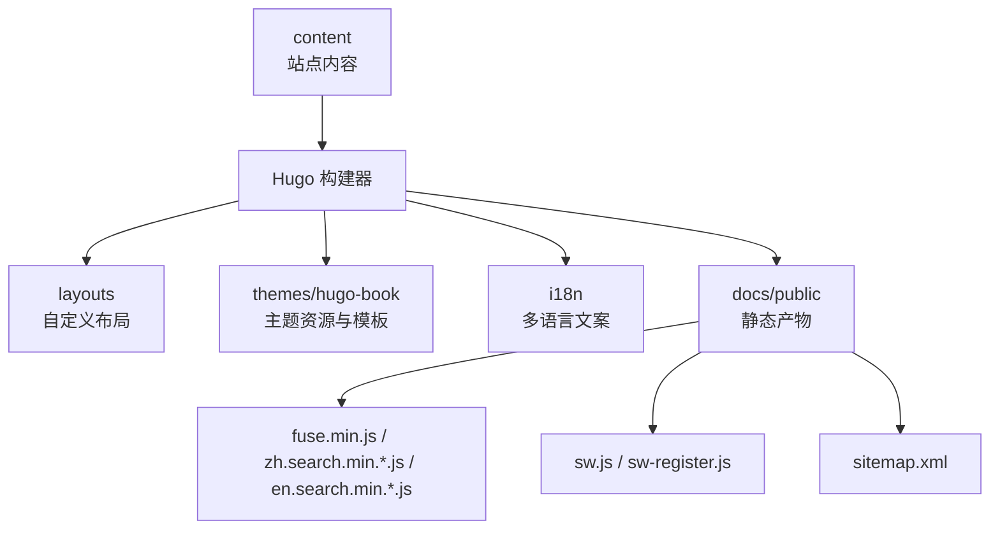
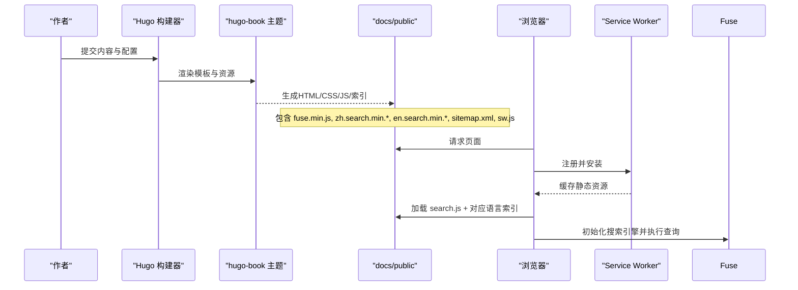
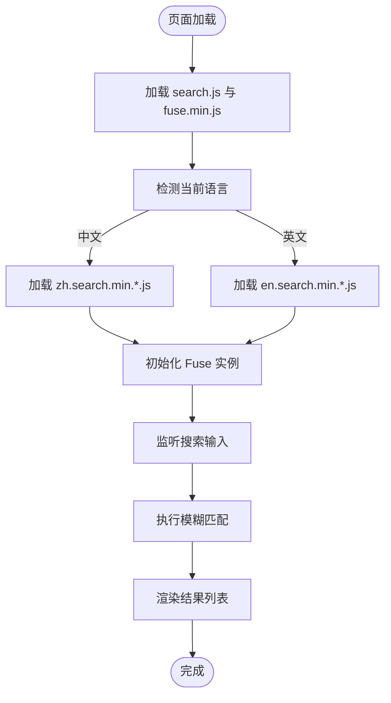
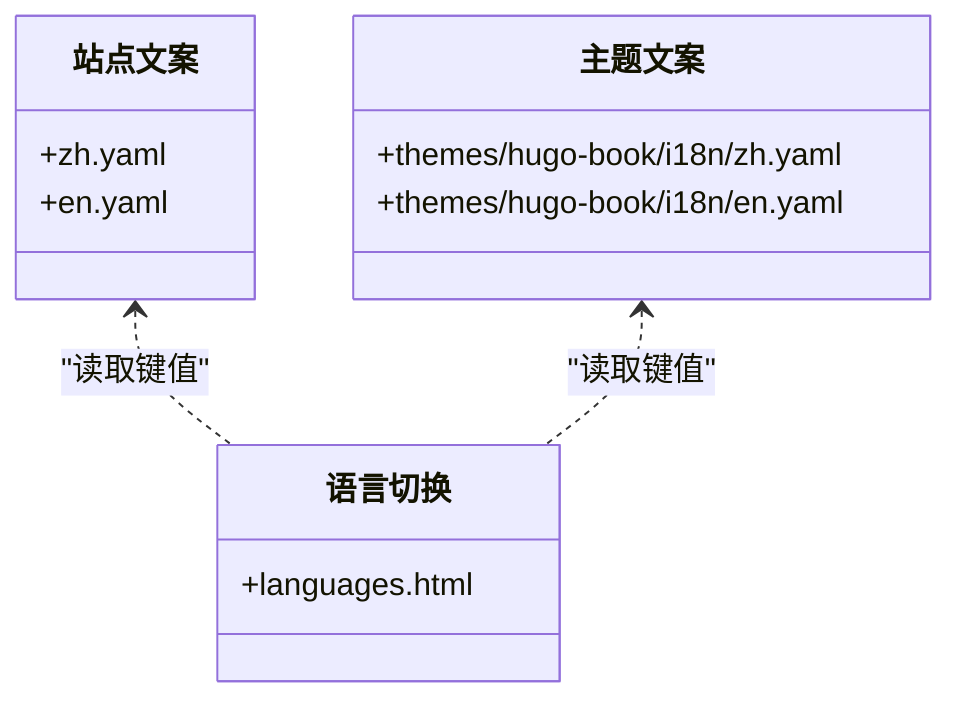
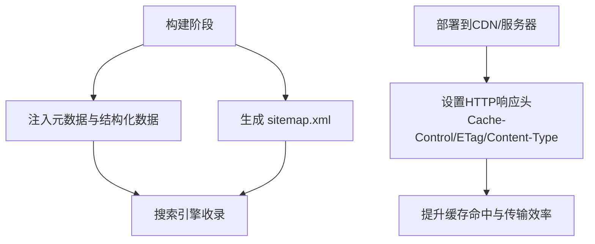
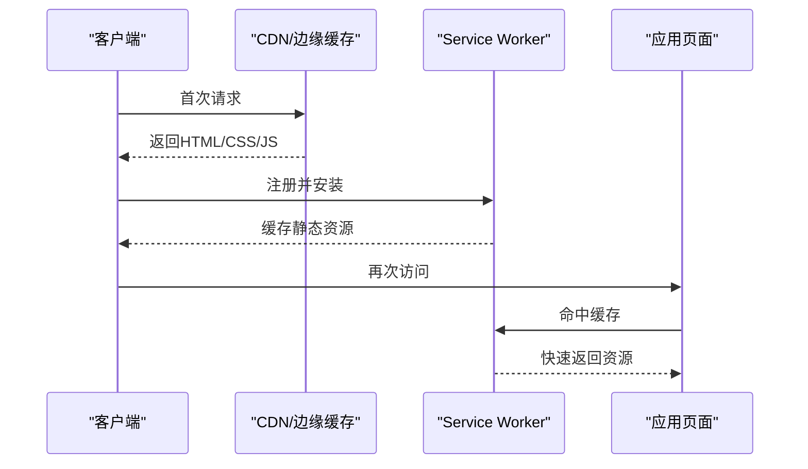
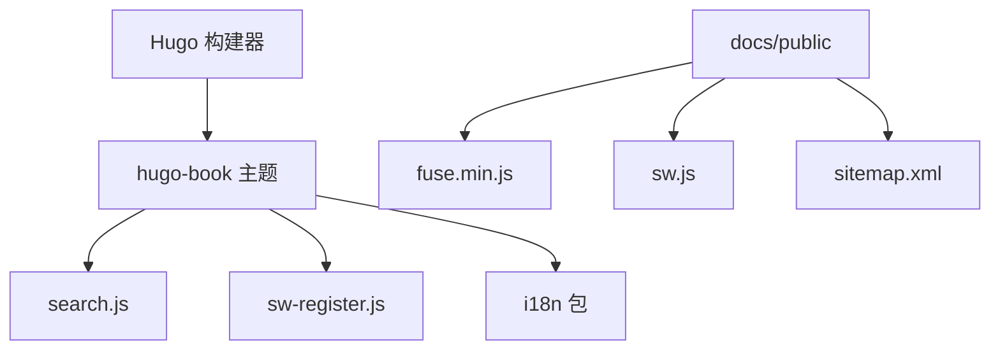

# 高级功能

<cite>
**本文引用的文件**   
- [hugo.toml](file://hugo.toml)
- [config.yaml](file://config.yaml)
- [README.md](file://README.md)
- [themes/hugo-book/assets/search.js](file://themes/hugo-book/assets/search.js)
- [themes/hugo-book/layouts/partials/docs/search.html](file://themes/hugo-book/layouts/partials/docs/search.html)
- [themes/hugo-book/static/fuse.min.js](file://themes/hugo-book/static/fuse.min.js)
- [docs/fuse.min.js](file://docs/fuse.min.js)
- [docs/sw.js](file://docs/sw.js)
- [docs/zh.search.min.*.js](file://docs/zh.search.min.*)
- [docs/en.search.min.*.js](file://docs/en.search.min.*)
- [docs/sitemap.xml](file://docs/sitemap.xml)
- [layouts/_default/baseof.html](file://layouts/_default/baseof.html)
- [layouts/partials/docs/html-head.html](file://layouts/partials/docs/html-head.html)
- [layouts/partials/docs/languages.html](file://layouts/partials/docs/languages.html)
- [i18n/zh.yaml](file://i18n/zh.yaml)
- [i18n/en.yaml](file://i18n/en.yaml)
- [themes/hugo-book/i18n/zh.yaml](file://themes/hugo-book/i18n/zh.yaml)
- [themes/hugo-book/i18n/en.yaml](file://themes/hugo-book/i18n/en.yaml)
</cite>

## 目录
1. [简介](#简介)
2. [项目结构](#项目结构)
3. [核心组件](#核心组件)
4. [架构总览](#架构总览)
5. [详细组件分析](#详细组件分析)
6. [依赖分析](#依赖分析)
7. [性能考虑](#性能考虑)
8. [故障排除指南](#故障排除指南)
9. [结论](#结论)
10. [附录](#附录)

## 简介
本文件面向高级用户与站点维护者，聚焦以下能力：全文搜索（Fuse.js）、国际化（i18n）、SEO优化、性能优化（压缩/缓存/懒加载）、数据分析集成、API/Webhook集成、安全配置、监控与日志收集，以及故障排除与调试技巧。文档基于仓库中的Hugo主题与生成产物进行说明，并提供可操作的配置建议与最佳实践。

## 项目结构
该站点采用Hugo静态站点生成器与hugo-book主题。关键目录与职责：
- content：站点内容源（Markdown）
- layouts：自定义布局覆盖
- i18n：多语言文案
- themes/hugo-book：主题源码（含搜索、SW注册、部分模板等）
- docs/public：构建输出（包含生成的搜索索引、服务工作者、站点地图等）

图表来源
- [hugo.toml:1-200](file://hugo.toml#L1-L200)
- [config.yaml:1-200](file://config.yaml#L1-L200)
- [themes/hugo-book/assets/search.js:1-200](file://themes/hugo-book/assets/search.js#L1-L200)
- [themes/hugo-book/layouts/partials/docs/search.html:1-200](file://themes/hugo-book/layouts/partials/docs/search.html#L1-L200)
- [docs/fuse.min.js:1-200](file://docs/fuse.min.js#L1-L200)
- [docs/sw.js:1-200](file://docs/sw.js#L1-L200)
- [docs/sitemap.xml:1-200](file://docs/sitemap.xml#L1-L200)

章节来源
- [README.md:1-200](file://README.md#L1-L200)
- [hugo.toml:1-200](file://hugo.toml#L1-L200)
- [config.yaml:1-200](file://config.yaml#L1-L200)

## 核心组件
- 全文搜索：基于Fuse.js的客户端搜索，通过主题search.js与生成的多语言索引文件实现。
- 国际化：通过i18n目录与主题内置多语言包提供界面文案；内容可按语言组织。
- SEO：自动生成sitemap.xml，支持在布局中注入元数据与结构化数据。
- 性能：主题提供Service Worker与资源注册脚本，结合Hugo构建优化。
- 监控与日志：可在布局中嵌入第三方统计脚本与服务端日志采集方案。
- API/Webhook：通过外部JS调用或服务端代理处理Webhook事件。
- 安全：HTTPS与安全头由部署环境（CDN/反向代理）控制，站点侧可配合CSP等策略。

章节来源
- [themes/hugo-book/assets/search.js:1-200](file://themes/hugo-book/assets/search.js#L1-L200)
- [themes/hugo-book/layouts/partials/docs/search.html:1-200](file://themes/hugo-book/layouts/partials/docs/search.html#L1-L200)
- [docs/fuse.min.js:1-200](file://docs/fuse.min.js#L1-L200)
- [docs/sw.js:1-200](file://docs/sw.js#L1-L200)
- [docs/sitemap.xml:1-200](file://docs/sitemap.xml#L1-L200)

## 架构总览
下图展示从内容到最终产物的流程，以及搜索、国际化、SEO与PWA相关的关键路径。

图表来源
- [themes/hugo-book/assets/search.js:1-200](file://themes/hugo-book/assets/search.js#L1-L200)
- [themes/hugo-book/layouts/partials/docs/search.html:1-200](file://themes/hugo-book/layouts/partials/docs/search.html#L1-L200)
- [docs/fuse.min.js:1-200](file://docs/fuse.min.js#L1-L200)
- [docs/sw.js:1-200](file://docs/sw.js#L1-L200)
- [docs/sitemap.xml:1-200](file://docs/sitemap.xml#L1-L200)

## 详细组件分析

### 全文搜索（Fuse.js）
- 原理
  - 构建期：主题根据内容生成多语言搜索索引（如 zh.search.min.*.js、en.search.min.*.js），并在页面中引入 fuse.min.js 与 search.js。
  - 运行期：search.js 初始化 Fuse 实例，加载对应语言索引，监听输入事件，返回匹配结果并高亮显示。
- 配置要点
  - 语言选择：根据当前语言动态加载对应的搜索索引文件。
  - 字段权重：可通过主题配置调整标题、正文、标签等字段的权重。
  - 阈值与最小匹配长度：平衡召回率与性能。
- 索引优化
  - 仅索引必要字段（标题、摘要、正文）。
  - 对长文使用分页或分块索引，减少首屏体积。
  - 使用预编译的 min 版本索引文件，降低解析开销。
- 算法调优
  - 调整 includeScore、ignoreLocation、threshold 等参数以获得更精准的排序。
  - 针对中文场景，优先使用主题提供的中文索引生成逻辑，避免自行分词。

图表来源
- [themes/hugo-book/assets/search.js:1-200](file://themes/hugo-book/assets/search.js#L1-L200)
- [themes/hugo-book/layouts/partials/docs/search.html:1-200](file://themes/hugo-book/layouts/partials/docs/search.html#L1-L200)
- [docs/fuse.min.js:1-200](file://docs/fuse.min.js#L1-L200)
- [docs/zh.search.min.*.js:1-200](file://docs/zh.search.min.*.js#L1-L200)
- [docs/en.search.min.*.js:1-200](file://docs/en.search.min.*.js#L1-L200)

章节来源
- [themes/hugo-book/assets/search.js:1-200](file://themes/hugo-book/assets/search.js#L1-L200)
- [themes/hugo-book/layouts/partials/docs/search.html:1-200](file://themes/hugo-book/layouts/partials/docs/search.html#L1-L200)
- [docs/fuse.min.js:1-200](file://docs/fuse.min.js#L1-L200)
- [docs/zh.search.min.*.js:1-200](file://docs/zh.search.min.*.js#L1-L200)
- [docs/en.search.min.*.js:1-200](file://docs/en.search.min.*.js#L1-L200)

### 国际化（i18n）
- 配置与管理
  - 站点级文案：在 i18n 目录下按语言创建 YAML 文件（如 zh.yaml、en.yaml），定义键值对。
  - 主题文案：主题自带多语言包，位于 themes/hugo-book/i18n，可覆盖或扩展。
  - 语言切换：通过 partials/languages.html 渲染语言菜单，结合路由前缀或查询参数切换。
- 内容组织
  - 将不同语言的内容分别放入 content/<lang>/... 或使用单文件多语言段落。
  - 在 front matter 中指定 language 或默认语言。
- 最佳实践
  - 统一键名命名规范，避免硬编码字符串。
  - 为缺失翻译提供回退语言（通常为英文）。
  - 在构建时校验翻译完整性。

图表来源
- [i18n/zh.yaml:1-200](file://i18n/zh.yaml#L1-L200)
- [i18n/en.yaml:1-200](file://i18n/en.yaml#L1-L200)
- [themes/hugo-book/i18n/zh.yaml:1-200](file://themes/hugo-book/i18n/zh.yaml#L1-L200)
- [themes/hugo-book/i18n/en.yaml:1-200](file://themes/hugo-book/i18n/en.yaml#L1-L200)
- [layouts/partials/docs/languages.html:1-200](file://layouts/partials/docs/languages.html#L1-L200)

章节来源
- [i18n/zh.yaml:1-200](file://i18n/zh.yaml#L1-L200)
- [i18n/en.yaml:1-200](file://i18n/en.yaml#L1-L200)
- [themes/hugo-book/i18n/zh.yaml:1-200](file://themes/hugo-book/i18n/zh.yaml#L1-L200)
- [themes/hugo-book/i18n/en.yaml:1-200](file://themes/hugo-book/i18n/en.yaml#L1-L200)
- [layouts/partials/docs/languages.html:1-200](file://layouts/partials/docs/languages.html#L1-L200)

### SEO优化
- 元数据
  - 在 baseof.html 与 html-head.html 中注入 title、description、canonical、open graph 等标签。
  - 为每篇文章设置 front matter 的 seo 相关字段。
- 结构化数据
  - 在页面头部注入 JSON-LD（文章、站点、面包屑等）。
- 站点地图
  - Hugo 自动或插件生成 sitemap.xml，确保收录完整。
- 其他
  - robots.txt 控制爬虫抓取范围。
  - 图片与字体使用现代格式与合适的缓存头。

图表来源
- [layouts/_default/baseof.html:1-200](file://layouts/_default/baseof.html#L1-L200)
- [layouts/partials/docs/html-head.html:1-200](file://layouts/partials/docs/html-head.html#L1-L200)
- [docs/sitemap.xml:1-200](file://docs/sitemap.xml#L1-L200)

章节来源
- [layouts/_default/baseof.html:1-200](file://layouts/_default/baseof.html#L1-L200)
- [layouts/partials/docs/html-head.html:1-200](file://layouts/partials/docs/html-head.html#L1-L200)
- [docs/sitemap.xml:1-200](file://docs/sitemap.xml#L1-L200)

### 性能优化
- 资源压缩
  - 启用Hugo资源管道压缩（CSS/JS/图片），使用minified版本。
- 缓存策略
  - 利用Service Worker缓存静态资源与搜索结果索引，提高二次访问速度。
  - 设置合理的 Cache-Control 与 ETag。
- 懒加载
  - 图片与代码块按需加载，减少首屏压力。
- 构建优化
  - 按需加载主题资源，移除未使用的样式与脚本。
  - 使用预编译的搜索索引与库（fuse.min.js）。

图表来源
- [docs/sw.js:1-200](file://docs/sw.js#L1-L200)
- [themes/hugo-book/assets/sw-register.js:1-200](file://themes/hugo-book/assets/sw-register.js#L1-L200)

章节来源
- [docs/sw.js:1-200](file://docs/sw.js#L1-L200)
- [themes/hugo-book/assets/sw-register.js:1-200](file://themes/hugo-book/assets/sw-register.js#L1-L200)

### 数据分析集成
- Google Analytics
  - 在 html-head.html 中插入GA脚本与配置，启用匿名IP与事件追踪。
- 百度统计
  - 在 html-head.html 中插入Baidu Tongji脚本，配置域名与自定义变量。
- 隐私合规
  - 提供同意管理弹窗，仅在用户同意后加载统计脚本。
  - 遵守GDPR/CCPA等法规要求。

章节来源
- [layouts/partials/docs/html-head.html:1-200](file://layouts/partials/docs/html-head.html#L1-L200)

### API集成与Webhook处理
- 外部服务调用
  - 在前端通过 fetch 调用只读API，注意跨域与鉴权。
  - 使用环境变量或构建时注入密钥，避免硬编码。
- Webhook处理
  - 通过后端代理（如Cloudflare Workers、Vercel Edge Functions）接收Webhook，验证签名后转发至内部系统。
  - 记录请求日志与错误码，便于排障。

章节来源
- [layouts/partials/docs/html-head.html:1-200](file://layouts/partials/docs/html-head.html#L1-L200)

### 安全配置与最佳实践
- HTTPS
  - 强制HTTPS跳转，启用HSTS。
- 安全头
  - 设置 Content-Security-Policy、X-Frame-Options、Referrer-Policy 等。
- 资源完整性
  - 使用SRI校验第三方脚本完整性。
- 敏感信息
  - 不在前端暴露密钥，使用后端代理或环境变量。

章节来源
- [layouts/_default/baseof.html:1-200](file://layouts/_default/baseof.html#L1-L200)
- [layouts/partials/docs/html-head.html:1-200](file://layouts/partials/docs/html-head.html#L1-L200)

### 监控与日志收集
- 前端监控
  - 接入错误上报SDK，捕获JS异常与网络失败。
- 日志收集
  - 使用集中式日志平台（如ELK、Sentry）聚合错误与性能指标。
- 可用性监控
  - 配置心跳探测与告警规则。

章节来源
- [layouts/partials/docs/html-head.html:1-200](file://layouts/partials/docs/html-head.html#L1-L200)

## 依赖分析
- 主题依赖
  - hugo-book 主题提供搜索、SW、i18n等能力。
- 运行时依赖
  - fuse.min.js 用于客户端模糊搜索。
  - Service Worker 用于离线与缓存。
- 构建依赖
  - Hugo 负责模板渲染与资源优化。

图表来源
- [hugo.toml:1-200](file://hugo.toml#L1-L200)
- [config.yaml:1-200](file://config.yaml#L1-L200)
- [themes/hugo-book/assets/search.js:1-200](file://themes/hugo-book/assets/search.js#L1-L200)
- [themes/hugo-book/assets/sw-register.js:1-200](file://themes/hugo-book/assets/sw-register.js#L1-L200)
- [docs/fuse.min.js:1-200](file://docs/fuse.min.js#L1-L200)
- [docs/sw.js:1-200](file://docs/sw.js#L1-L200)
- [docs/sitemap.xml:1-200](file://docs/sitemap.xml#L1-L200)

章节来源
- [hugo.toml:1-200](file://hugo.toml#L1-L200)
- [config.yaml:1-200](file://config.yaml#L1-L200)

## 性能考虑
- 首屏优化
  - 延迟加载非关键脚本（如搜索、统计）。
  - 使用预连接与预取关键资源。
- 缓存策略
  - 静态资源长期缓存，HTML短缓存或无缓存。
  - Service Worker缓存索引与常用资源。
- 资源体积
  - 裁剪主题资源，禁用未使用特性。
  - 图片使用WebP/AVIF与自适应尺寸。

[本节为通用指导，不直接分析具体文件]

## 故障排除指南
- 搜索无结果
  - 检查当前语言索引是否加载成功。
  - 确认 fuse.min.js 与 search.js 版本兼容。
  - 查看控制台是否有跨域或脚本加载错误。
- 国际化文案缺失
  - 检查 i18n 文件中键是否存在。
  - 确认语言切换逻辑是否正确传递语言参数。
- PWA缓存问题
  - 清除SW缓存并重新注册。
  - 检查 sw.js 的缓存策略与版本号。
- SEO未收录
  - 确认 sitemap.xml 已生成且可访问。
  - 检查 robots.txt 是否屏蔽了重要路径。

章节来源
- [themes/hugo-book/assets/search.js:1-200](file://themes/hugo-book/assets/search.js#L1-L200)
- [themes/hugo-book/layouts/partials/docs/search.html:1-200](file://themes/hugo-book/layouts/partials/docs/search.html#L1-L200)
- [docs/sw.js:1-200](file://docs/sw.js#L1-L200)
- [docs/sitemap.xml:1-200](file://docs/sitemap.xml#L1-L200)

## 结论
通过合理配置与优化，本项目可实现高性能的全文搜索、完善的国际化体验、良好的SEO表现与稳定的PWA能力。建议在部署层强化安全头与HTTPS，并结合监控与日志体系保障稳定性与可观测性。

[本节为总结，不直接分析具体文件]

## 附录
- 参考链接
  - Hugo官方文档
  - hugo-book主题文档
  - Fuse.js文档
  - Service Worker指南
  - SEO最佳实践

[本节为参考资料，不直接分析具体文件]